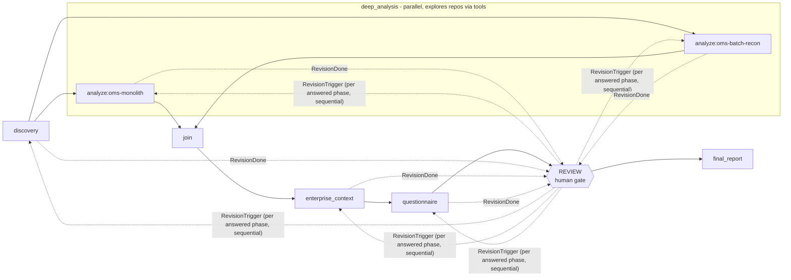
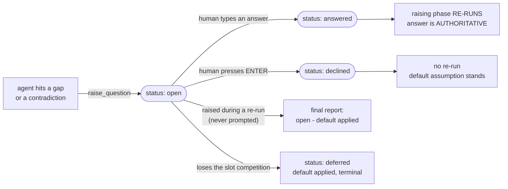
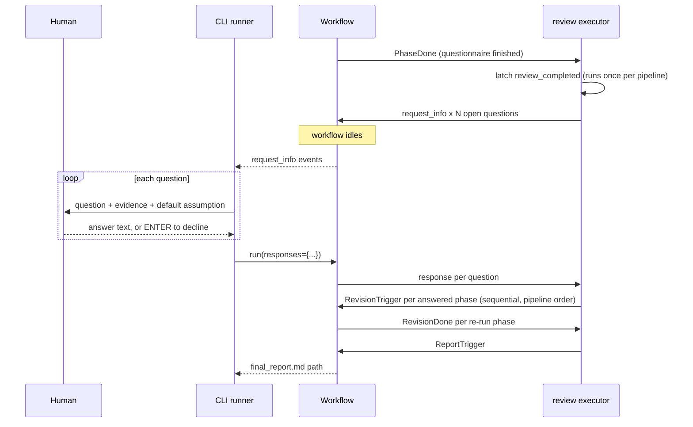
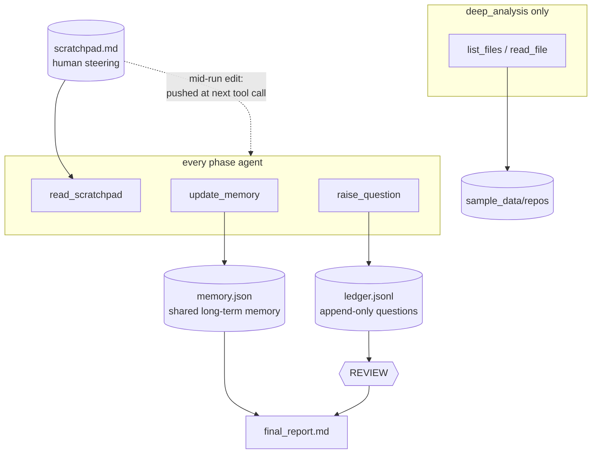
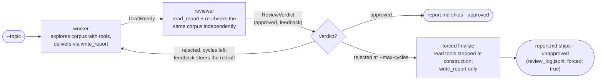
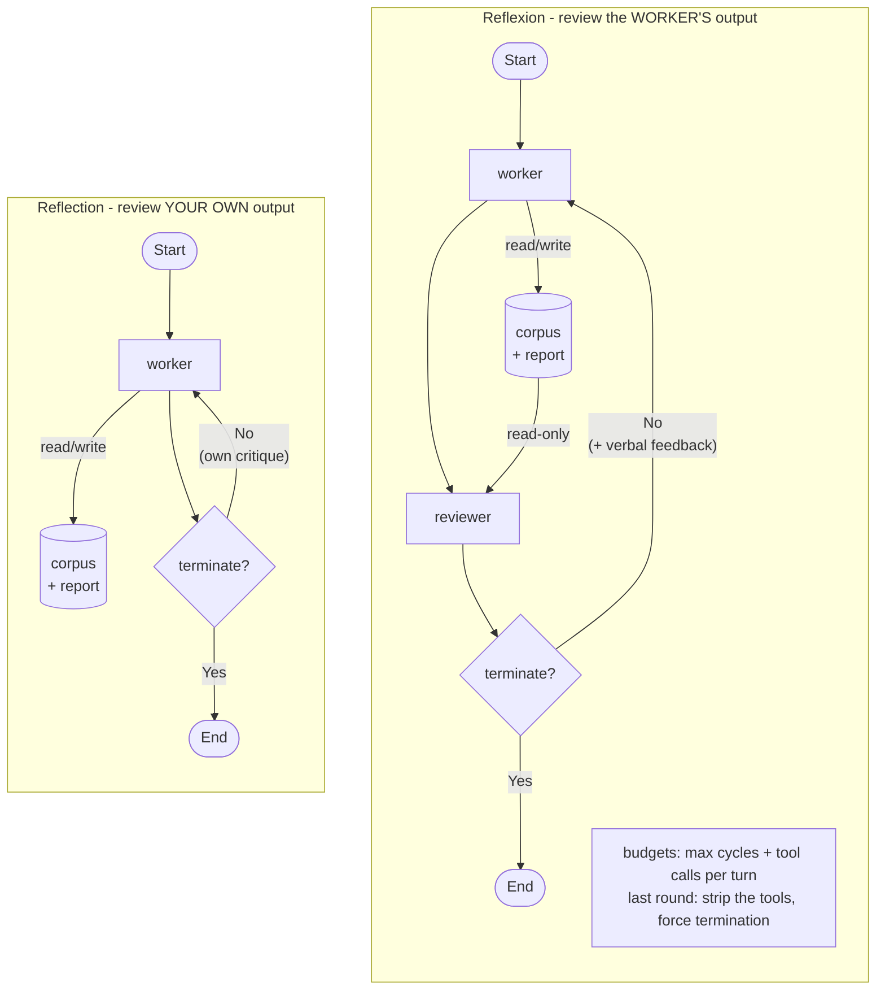
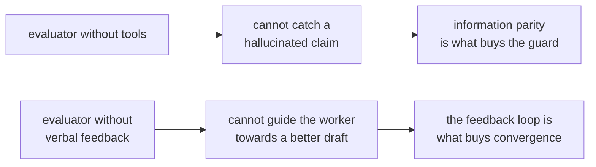
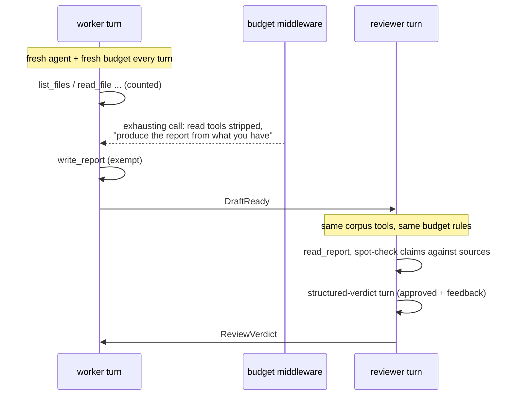
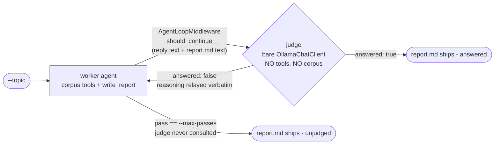

# agent-framework-hotl

Human-on-the-loop (HOTL) demo on
[Microsoft Agent Framework](https://github.com/microsoft/agent-framework):
a multi-phase agent pipeline that assesses a fictional legacy system's cloud
migration readiness, accumulates a **ledger of questions** needing human
adjudication, pauses **exactly once** at a review gate, selectively re-runs
affected phases with the human's answers, and accepts freeform steering via a
**scratchpad** file - read at phase start, and pushed to agents mid-run when
the human edits it while the pipeline is working.

The repo also carries a second, standalone demo of the **reflexion**
pattern - a worker/reviewer loop with information parity and budget-forced
convergence - see [The reflexion demo](#the-reflexion-demo).

Design specs:
`docs/superpowers/specs/2026-07-14-hotl-pipeline-design.md` (pipeline),
`docs/superpowers/specs/2026-07-15-live-scratchpad-steering-design.md`
(live steering), and
`docs/superpowers/specs/2026-07-17-reflexion-demo-design.md` (reflexion)

## The pipeline



- **discovery** - what does this system REALLY do (docs vs code)?
- **deep_analysis** - one agent per repo, in parallel; explores its repo
  agentically via `list_files`/`read_file` tools; per-repo reports
- **enterprise_context** - corporate cloud strategy + security standards
  overlay
- **questionnaire** - fills the standard readiness question template
- **review** - the human gate: answer (authoritative) or decline (default
  assumption applies)
- **final_report** - readiness scorecard + recommendation + adjudication log

## The HOTL model

"Human-**on**-the-loop" rather than "in-the-loop": the pipeline runs to
completion on its own and **never blocks waiting for a human**. When an agent
hits a gap or a contradiction it records the question, states the assumption
it will proceed on, and carries on. The human supervises rather than
authorises.

There are exactly two channels from human to pipeline, and they are
deliberately different shapes:

| | Channel 1: question ledger | Channel 2: scratchpad |
|---|---|---|
| Shape | Structured questions with defaults | Freeform markdown |
| Who initiates | The **agent** (`raise_question`) | The **human** |
| When | Once, after `questionnaire` | Any time - before or during a run |
| How often | **Exactly once per run** | Unlimited |
| Blocks the run? | Yes - the workflow idles at the gate | No - never blocks |
| Effect of input | Answer re-runs the raising phase | Advisory; the agent judges relevance |
| Reaches finished phases? | Yes, via targeted re-run | No - only agents still working |

The asymmetry is the point. Interrupting a human is expensive, so the
structured channel is rationed to one batch. Steering is cheap, so the
freeform channel is unlimited.

## Channel 1: the question ledger

### Raising a question never blocks

Phase prompts instruct agents: when evidence conflicts or a decision-critical
fact is missing, call `raise_question` with the assumption you will proceed
on, then **proceed on it**. The tool returns the assigned id and says so
explicitly:

```text
Recorded q-1. Proceed using your stated default assumption.
```

That default is what makes the pipeline closed by construction. A run with
zero human input still produces a complete report - just one built on stated
assumptions rather than adjudicated facts.

### The ledger entry

`ledger.jsonl` is append-only, one JSON object per line:

```json
{
  "id": "q-3",
  "phase": "deep_analysis",
  "unit": "oms-batch-recon",
  "question": "Remediate the hardcoded DB credentials before or during migration?",
  "context": "config.py holds a plaintext password; the security standard forbids credentials in code.",
  "impact": "If remediation must precede migration it adds a pre-cutover security workstream; if it can happen during, it folds into the cutover runbook.",
  "importance": "medium",
  "default_assumption": "Move to a vault and rotate before migration",
  "status": "open | answered | declined | deferred",
  "human_answer": null,
  "asked_at": "2026-07-15T20:41:07"
}
```

`phase` and `unit` are **not supplied by the model**. The tools are
closure-bound to the calling `(phase, unit)` in `tools.py`, so an agent cannot
forge attribution or write into another repo's section. `unit` is the repo
name for `deep_analysis` questions and `null` everywhere else - that pair is
exactly what the gate later re-runs.

`importance` (high / medium / low) and `impact` - how the human's answer
would change the migration decision - are agent-declared, tool-validated,
and exist for the slot competition below.

### Accumulation and duplicate suppression

The ledger grows across phases, and every phase's prompt is rendered with the
**current open ledger** plus an instruction not to re-raise anything already
there. Duplicate suppression is therefore prompt-level, not structural - no
curation machinery, no dedupe pass. The trade is that suppression is only as
reliable as the model.

### Lifecycle of a question



## The review gate

The pause/resume is the framework's native `request_info` mechanism - the
workflow genuinely idles while the human decides:



The rules the gate enforces:

1. **It runs exactly once.** Entering the gate latches `review_completed` in
   `memory.json`. This is the whole point of the demo: an agent pipeline that
   asks for help *once*, in one batch, instead of nagging.
2. **Slots are scarce - questions compete.** The gate presents at most
   `--max-questions` (default 3). When more are open, one LLM ranking call
   orders them by expected swing on the final report - judging each
   question's substance and impact statement, with the declared importance
   as one input; raise order carries no signal. Losers are marked
   `deferred`: their defaults stand and the adjudication log says so. The
   ranker is fenced (validated output, one retry, deterministic fallback),
   and `--max-questions 0` defers everything - the fully autonomous run.
3. **Answer = authoritative.** Typed text is injected into the re-run prompt
   marked `AUTHORITATIVE`, overriding any conflicting document or code
   evidence.
4. **Decline = the default stands.** Empty input (or a closed stdin) costs
   nothing and triggers no re-run. The stated assumption was already applied,
   so the report is already consistent with it.
5. **Only answered phases re-run**, and only the exact `(phase, unit)` that
   raised the question - answering a `oms-batch-recon` question re-runs that
   one analyzer, not its sibling. Re-runs are sequential, in pipeline order.
6. **Questions raised during a re-run are never prompted.** They append to the
   ledger and the final report lists them as *open - default assumption
   applied*. Otherwise "review once" would be a lie.

### A deliberate simplification

Re-runs do **not** cascade downstream: an answered `discovery` question
re-runs `discovery` alone. Downstream phases change only if they raised
answered questions themselves. The verdict still absorbs every answer, because
`final_report` synthesises from post-adjudication `memory.json`. Marked in the
code with a `ponytail:` comment; the upgrade path is to cascade from the
earliest affected phase.

### The adjudication log is not written by the LLM

`final_report.md` ends with a table rendered deterministically from
`ledger.jsonl` by plain code - answered questions with the human's verbatim
answer, declined and still-open ones with the default that was applied. The
narrative above it is the model's; the decision record is not, so it cannot be
hallucinated.

## Channel 2: the scratchpad

`scratchpad.md` (repo root, stable path, starts empty) is the freeform
channel. Write guidance into it at any time - before a run, or while one is
executing:

```markdown
The nightly reconciliation job is business-critical - treat it as a
first-class migration workload, not a peripheral batch process.

Data residency: assume EU (Ireland). Do not raise further questions on it.
```

It reaches agents two ways:

- **Pulled**, once per phase: every phase agent calls the `read_scratchpad`
  tool before starting work.
- **Pushed**, thereafter: if you edit the file *while* a phase is running, the
  change is delivered to every agent still working, arriving at that agent's
  next tool call. Each agent decides for itself whether the guidance is
  relevant to its phase.

Watch for the push in the run output:

```text
  [steering] scratchpad update queued for analyze:oms-monolith
```

### How the push works

`ScratchpadWatch` (one per agent - the analyzers run concurrently, so a shared
watermark would let one steal the other's notification) is polled by function
middleware after every tool call. A content change - not an mtime change, so
re-saving an unedited file is silent - is handed to the framework's
`MessageInjectionMiddleware`, which drains it into that agent's next model
call.

An LLM turn cannot be interrupted, so a tool call is the earliest possible
delivery point. That is why there is no file watcher: delivery would wait for
the same boundary anyway, so a watcher thread would buy nothing.

One useful property comes free: if an agent was about to finish and emit its
report, `MessageInjectionMiddleware` forces one extra model call rather than
letting the notice miss the boat.

### Limits worth knowing

- **It does not re-run finished phases.** An edit during `final_report`
  changes nothing upstream - that is the review gate's job.
- **The agent may reasonably ignore it.** The notice explicitly says to ignore
  irrelevant guidance, and it will. Steering that is on-topic for the phase
  lands; arbitrary instructions may not.
- **Clearing the scratchpad notifies nobody.** Withdrawing guidance is not new
  guidance to act on.

## Bounded context (compaction)

Local models have small windows (Ollama defaults to 4096 tokens) and, when a
conversation exceeds one, Ollama silently drops the OLDEST tokens - the system
prompt and task framing - producing off-task reports with no error anywhere.

Every phase agent therefore runs a compaction pipeline on each model call,
including between tool calls: old tool-call groups are evicted first
(newest 2 kept verbatim), the remainder is LLM-summarized if still over
budget, and a deterministic oldest-first fallback makes the budget a hard
guarantee. The budget is `0.8 * (num_ctx - 1024)`. Watch for:

```text
deep_analysis:oms-monolith: compacted context 14 -> 6 messages (~3124 -> 1893 tokens)
```

Size the window with `--num-ctx` (or `OLLAMA_NUM_CTX`); the same value is sent
to Ollama as `num_ctx`, so the server window and the compaction budget always
agree. Durable findings survive compaction by design: they live in
`memory.json` and the report drafts, not in chat history.

## Artifacts



Everything lands in `output/run_<timestamp>/`: one markdown report per phase
(overwritten on revision), `memory.json`, `ledger.jsonl`, and
`final_report.md`. `scratchpad.md` deliberately lives at the repo root
instead: it is an input the human owns, not a run artifact.

Every mutation goes through `ArtifactStore` (one lock, atomic temp-file +
`os.replace`), because the two analyzers write concurrently and a human may
have the files open mid-run.

## The reflexion demo

`poetry run reflexion` is a separate, self-contained demo in the same repo:
no imports from `hotl_demo`, only `sample_data/` and the local Ollama model
are shared. A **worker** agent researches a migration topic and writes a
report; a **reviewer** agent - holding the *same* read tools over the *same*
corpus - verifies that report against the sources itself and returns a
boolean verdict. Rejection feedback steers the next draft. Two budgets
guarantee the loop always lands on a report.



The graph is the framework's native cyclic-workflow shape (the same
`WorkflowBuilder` mechanics as the HOTL pipeline, two nodes and two message
types instead of seven): `worker -> reviewer -> worker`, with the worker
yielding the terminal output.

### Reflexion vs reflection

The names are one letter apart and are often used interchangeably. They
describe different loops:

- **Reflection** - *"review your own output."* One agent critiques and
  revises its own draft, judged against nothing but its own context.
- **Reflexion** - *"review the worker's output."* A separate evaluator
  judges the draft against an independent evidence channel and returns
  verbal feedback that steers the next attempt.



The two loops look almost identical on paper, and the resemblance is the
trap: the difference is not the node count, it is what the evaluator is
allowed to *see* and what it is able to *say*. Strip either one and the
pattern collapses back into reflection wearing a second hat:



A reviewer LLM with no tools is self-evaluation at twice the price: same
weights, same priors, same blind spots that produced the error in the first
place. A reviewer that returns a bare boolean can reject forever without
ever telling the worker why.

| | Reflection | Reflexion |
|---|---|---|
| Who judges | the worker, on its own output | a separate evaluator |
| Judged against | its own context and chat history | an independent evidence channel - tools, tests, environment |
| Feedback | implicit, inside one context | explicit text passed between turns |
| Loop shape | worker self-loop | worker `<->` evaluator cycle |
| Cost per round | one extra pass | two agent turns, each with tool calls |
| Catches | format, structure, tone, omissions it can already see | claims contradicted by the sources |
| Misses | anything it could not verify at generation time | anything outside the evaluator's reach |

#### Strengths and tradeoffs

**Reflexion** buys a guard that is independent of the thing it guards. The
evaluator can contradict the worker on facts, because it can go and check.
Feedback is actionable rather than a bare score, so rejection is steering
and not just a retry. The verdict trail is auditable after the fact
(`review_log.jsonl`). The price: two to ten times the tokens, a hard
dependency on an evidence channel worth trusting, and a new failure mode -
the evaluator is now the oracle, so a *wrong* rejection costs a full cycle
and can push the worker away from a correct draft. Nothing about the loop
guarantees termination, which is why both budgets exist.

**Reflection** is one agent and no graph, and it genuinely works where
verification is easier than generation *and* needs no outside evidence:
formatting, structure, tone, "did I actually answer the question", "is this
valid JSON". The price is that the model grading the work is the model that
did the work. On reasoning tasks this is not merely a weaker guard - the
published result is that intrinsic self-correction, with no external
feedback, *degrades* accuracy more often than it improves it. Treat it as
cheap polish, not as a correctness check.

The dividing line: the moment the question becomes *"is this claim true"*
rather than *"is this well written"*, self-critique has nothing to check
against and you need a grounding channel.

#### What this demo does and does not implement

The demo is the loop above. It is not the full architecture from the
Reflexion paper, which also accumulates every reflection in an episodic
memory buffer carried across trials - the "verbal reinforcement learning"
the paper is named for. Here the revision prompt receives the *latest*
verdict's feedback plus the previous report; earlier critiques are recorded
in `review_log.jsonl` but are not replayed to the worker. That is
deliberate: the subject of this demo is information parity and budgeted
termination, and a single-cycle feedback carry keeps the prompt small
enough to run on a local model.

Background reading: [Reflexion: Language Agents with Verbal Reinforcement
Learning](https://arxiv.org/abs/2303.11366) (Shinn et al., 2023) and [Large
Language Models Cannot Self-Correct Reasoning
Yet](https://arxiv.org/abs/2310.01798) (Huang et al., ICLR 2024).

### Information parity

The reviewer never takes the author's word for anything - and it can't be
fobbed off, because it holds the identical corpus binding:

| Tool | Worker | Reviewer | Counts against the budget |
|---|---|---|---|
| `list_files` / `read_file` (corpus) | yes | yes | yes |
| `write_report` | yes | - | no - delivery, not exploration |
| `read_report` | - | yes | yes |

Parity of information, asymmetry of authority: both agents see the same
sources; only the worker can write the report, only the reviewer can approve
it. The reviewer judges what was actually **written** (`read_report`), not
what the worker claims in conversation.

### Two budgets, one ending

Both budgets finish the same way: tools are taken away and the agent is told
to produce from what it already has.

- **Per-turn tool budget** (`--max-tool-calls`, default 12). Function
  middleware counts read-tool calls; the call that exhausts the budget still
  executes, then the read tools are stripped for the rest of the turn (the
  framework's live `remove_tools()` mutation point) and the nudge rides on
  that tool's result: *"you have been reasoning for a long time - produce
  the report now from the information you already have."* `write_report`
  survives the strip. Applies to worker and reviewer alike.
- **Review-cycle budget** (`--max-cycles`, default 3). A rejection at the
  last cycle triggers one final worker turn whose agent is *constructed*
  without read tools - then the report ships regardless, logged as forced.



The reviewer's turn is deliberately two calls in one session: an exploration
call with tools, then a schema-forced verdict call
(`{"approved": bool, "feedback": str}`). A verdict that fails to parse gets
one retry and then **fails closed** - an unverifiable draft is rejected,
never shipped as approved.

### Run the reflexion demo

```bash
poetry run reflexion                                    # defaults: 3 cycles, 12 tool calls/turn
poetry run reflexion --max-cycles 2 --max-tool-calls 8  # quickest full tour of both budgets
poetry run reflexion --topic "Assess retiring IBM MQ"   # any topic over the same corpus
```

The default topic (assess migrating OMS file storage from NFS to S3) is
chosen so the planted corpus conflicts - the Azure mandate vs `s3_uploader.py`,
data-residency and secrets standards - give the reviewer real grounds to
reject a shallow first draft. Watch the console for the mechanism firing:

```text
  [worker] tool budget exhausted (12 calls) - read tools stripped
  [reviewer] cycle 1: REJECTED
  [reviewer] feedback: The report ignores the enterprise Azure mandate...
== review budget exhausted: forced finalize (read tools stripped) ==
```

Artifacts land in `output/reflexion_<timestamp>/`: `report.md` (each
revision overwrites atomically) and `review_log.jsonl` - one line per cycle
plus an outcome line, written by plain code, never by the model:

```json
{"cycle": 1, "approved": false, "feedback": "...", "forced": false,
 "worker_tool_calls": 12, "reviewer_tool_calls": 9}
```

## The reflection demo

`poetry run reflection` is the A/B foil to the reflexion demo, and the
practical half of [Reflexion vs reflection](#reflexion-vs-reflection) above.
Same corpus, same default topic, same worker tool *set*, same report
artifact - and one variable changed on purpose: **the critic has no tools and
cannot reach the sources**. Both critics see the report.
Two further worker-side differences follow from the two demos being separate
packages rather than from the experiment; both are named under [Running the
A/B](#running-the-ab) below.



There is no `WorkflowBuilder`, no executors and no message types: one agent,
one `agent.run()` call, and `AgentLoopMiddleware` driving every pass from
inside. That absence is the finding - reflexion needs a graph because it has
two participants, reflection has one.

### Running the A/B

```bash
poetry run reflection --max-passes 3
poetry run reflexion  --max-cycles 3
diff output/reflection_<ts>/report.md output/reflexion_<ts>/report.md
```

Both default to the same topic, so the reports are directly comparable. The
planted corpus conflicts - the enterprise Azure mandate against
`s3_uploader.py`, the data-residency and secrets standards - are reachable
by *both* workers. Only the reflexion reviewer can open the sources and
check whether the report actually addressed them.

Two worker-side differences remain. Both fall out of the two demos being
separate packages, not out of the experiment, and both are stated here rather
than left for a skeptical reader to find:

- **Tool budget.** The reflexion worker runs under a 12-call-per-turn budget
  with mid-turn stripping (see [Two budgets, one
  ending](#two-budgets-one-ending)); this worker has none, because the strip
  mechanism is already demonstrated next door and repeating it would force a
  copy of `budget.py` into a package that must not import from a sibling. The
  tool *set* is identical, the *bound* is not - and the bound is what caps how
  much evidence a worker can gather, so this is a real difference, not a
  cosmetic one. It does not manufacture the expected result, though: it
  handicaps the *reflexion* side. The reflection worker is the less
  constrained of the two, so if it still misses the planted conflicts, the
  finding is stronger rather than weaker.
- **Delivery retry.** When the model finishes without calling `write_report`,
  reflexion issues a second `agent.run` with an explicit nudge before falling
  back to the longest reply. This demo cannot: a second `agent.run` re-enters
  `AgentLoopMiddleware` and would burn a pass. Its worker is nudged only
  *between* passes, so on the capped pass - and always under
  `--max-passes 1` - there is no retry at all and the longest reply is
  persisted directly. A live `--max-passes 1` run lands on exactly that path.
  This one cuts the other way, against the reflection side, and is the reason
  `worker.md` states that a `write_report` call is the only thing that saves
  the report.

### What differs

| | reflexion reviewer | reflection judge |
|---|---|---|
| What it is | an `Agent` node in a cyclic graph | a bare `OllamaChatClient`, called directly |
| Corpus tools | `list_files`, `read_file` | none |
| Report access | `read_report` - fetches the file itself | the predicate reads the file and hands over its text |
| Judges | the report, **against the sources** | the report, **on its own terms** |
| Terminal states | `approved` / `forced` (unapproved) | `answered` / `unjudged` |

**Both critics see the report; only the reflexion reviewer can check it
against the sources.** That is the single-variable difference. The judge is
still tool-less: the predicate reads `report.md` in plain Python and puts its
text in the prompt, so the artifact is delivered by the harness and corpus
access is the one thing the judge is denied. Handing it over is also what
makes the judge able to converge at all - the worker delivers through
`write_report`, so its reply text is an acknowledgement ("the report has been
written and saved successfully"), and a judge shown only that rates the claim
instead of the work: live runs had it reject *"the agent provided no
response"* while `report.md` held 5635 bytes, which made `answered`
unreachable and shipped every run `unjudged`. It matches the literature too -
in Self-Refine the critic always sees the draft; it just has no ground truth
to check it against.

The rubric is identical on **Actionability** and all but identical on
**Coverage** - the judge's Coverage line drops "in the sources", since it
holds none. That parity is deliberate: giving the two critics different
standards on the dimensions they can both assess would confound two variables
and prove nothing. **Accuracy** is
necessarily weaker on the reflection side: the reflexion reviewer is asked
whether "claims match the sources they cite", which a critic holding no
sources cannot evaluate, so the judge is asked only whether "claims are
consistent and the sources cited are named". That weakening is not a
confound - it *is* the finding. A tool-less critic cannot be given the
grounded rubric, and the closest honest rewording checks presentation where
the other checks fact.

The framework states the judge's tool-less shape itself, in the docstring of
its own judge builder: *"The judge is called directly (no agent tools,
session, or middleware)."*

### Gotchas worth knowing

`AgentLoopMiddleware` checks `max_iterations` **before** it evaluates
`should_continue`, so on the capped pass the judge is never consulted and
the report ships **unjudged** - the parallel of reflexion's forced finalize
shipping unapproved. `--max-passes 1` is the degenerate case: one pass, zero
verdicts.

The judge fails **open**: an unparseable verdict keeps the loop running,
where reflexion's reviewer fails **closed** and rejects. Both are right for
their pattern - reflexion must never ship unverified work as approved, while
here the pass cap is what guarantees termination. Reaching that fallback at
all takes a guard: `ChatResponse.value` parses *lazily*, so with
`response_format` set it raises `pydantic.ValidationError` on the first
non-conforming reply - which is precisely the reply the `VERDICT: DONE` /
`VERDICT: MORE` fallback exists for. Unguarded it escapes `agent.run()` and
kills the run before any report is written. The framework's own
`_build_judge_condition` reads `response.value` the same unguarded way.

The loop **replaces** the agent's input messages between passes instead of
appending to them, so `agent.run(prompt)` on its own gives pass 2 nothing but
a "Progress so far" digest and a nudge - no topic, no tool results. Continuity
comes from two places worth naming: the session (`agent.run(prompt,
session=agent.create_session())`, which attaches a history provider that
reloads the transcript each pass) and `inject_progress`, on by default, which
prepends the progress log - narrowed to just the latest entry once a session
is attached.

The session is the **expensive** route, chosen for fidelity and not for cost:
it re-sends the stored transcript - tool calls and their raw results, i.e.
every corpus file the worker read - *plus* the latest progress entry, where a
session-less run sends only a digest of prior pass texts. There is no
`compaction_strategy` on this agent (the HOTL phase agents have one), so a
3-pass corpus-reading run at the default `num_ctx=4096` can silently truncate.
Raise `--num-ctx` for multi-pass runs.

The judge is a bare `OllamaChatClient`, not an `Agent`, so `Agent`'s
`default_options={"num_ctx": ...}` never reaches it: there is no `Agent`
wrapper to carry that option. `num_ctx` has to be passed per call on
`get_response` instead, or Ollama silently truncates the judge's context and
it verdicts a report it only partly read - no error, no signal. The demo
threads `--num-ctx` through the CLI for exactly this reason.

`AgentLoopMiddleware` is `@experimental` and prints a warning on startup.
That is not filtered, on purpose.

Artifacts land in `output/reflection_<timestamp>/`: `report.md` and
`reflection_log.jsonl`, the same line shape as `review_log.jsonl` so the two
logs read side by side:

```json
{"pass": 1, "answered": false, "reasoning": "No mention of the Azure mandate...", "judged": true}
{"pass": 2, "answered": null, "reasoning": null, "judged": false}
{"outcome": "unjudged", "passes": 2, "report": "output/reflection_.../report.md"}
```

The demo could be one line shorter: `AgentLoopMiddleware.with_judge(client,
criteria=[...])` builds almost this exact loop, and is not used, for two
reasons. The lesser one: it builds the predicate internally, so the judge's
verdicts - the whole payload of an A/B run - would be unobservable. The
larger one: `with_judge`'s `_build_judge_condition` splats
`*last_result.messages` into the judge's prompt, and that message list
carries `role="tool"` messages with `function_result` content (the raw
corpus text, verbatim) plus `assistant` messages with `text_reasoning`
traces that can quote it too. The framework's built-in judge is not
information-isolated: it reads the tool output. Verified against a live
model with the worker explicitly instructed not to quote the file, and the
corpus marker still reached the judge twice. This demo passes the judge
`last_result.text`, which filters to text content and excludes both channels,
plus the report's text read off disk by the predicate - the harness chooses
what crosses over, which is what keeps the corpus on this side of it.

## Prerequisites

- Python 3.10+ and [Poetry](https://python-poetry.org/)
- [Ollama](https://ollama.com/) running locally with the model pulled:

```bash
ollama pull gemma4:31b
```

## Run the demo

```bash
poetry install
poetry run demo    # or: poetry run demo --model <other-tools-capable-model>
```

The four phases run autonomously (the two repo analyzers in parallel), each
writing a markdown report, updating `memory.json`, and appending questions to
`ledger.jsonl`. Then the review gate presents every open question:

```text
[q-1] (discovery) Is reconciliation functionality in migration scope?
      Evidence: oms-batch-recon performs financial reconciliation; absent
      from the architecture doc.
      Default if declined: in scope.
      Your answer (ENTER to decline): _
```

Type an answer to make it authoritative (the raising phase re-runs with it),
or press ENTER to decline (the stated default stands).

Pass `--max-questions N` to change the slot budget (default 3; `0` never
pauses and runs entirely on defaults). Paused runs created before this
feature cannot be resumed - the checkpointed question schema changed - so
start those assessments fresh.

### Pausing for days: `--pause` / `--resume`

Gathering real answers can take days, and holding a live process open for
that is the wrong shape. With `--pause` the run checkpoints at the gate and
exits:

```bash
poetry run demo --pause
# == PAUSED at the review gate - 5 open questions ==
# Fill in the answers in output/run_<ts>/review.jsonl
# Then: poetry run demo --resume output/run_<ts>
```

`review.jsonl` carries only the human's input - one `{"id", "answer"}` line
per question, seeded empty. The question text stays in `ledger.jsonl`
(agent-curated, read-only); a frontend joins the two on `id`. Leave an answer
empty to decline. Resuming restores the exact gate state and re-runs **zero**
phases - only the answered phases revise, then the report lands. Resume with
the same `--model` the run was paused with; a run that raises no questions
never pauses. A malformed answer line aborts loudly rather than silently
becoming a decline.

To see the scratchpad channel too, edit `scratchpad.md` while the analyzers
are still working and watch for the `[steering]` line.

## Editing the prompts

Phase prompts are not hardcoded: they live in `src/hotl_demo/prompts/` as
markdown files with YAML frontmatter (phase metadata: `name`, `order`,
`per_repo`, `report_filename`) and Jinja2 bodies (the phase instructions;
analyzers receive `{{ unit }}`). Shared wrappers `initial.md` / `revision.md`
/ `final_report.md` assemble the full prompts from `{{ sources }}`,
`{{ memory }}`, `{{ open_questions }}`, etc. Edit the markdown, rerun the
demo - no Python changes needed.

## The sample data

Everything under `sample_data/` is synthetic: three enterprise PDFs
(regenerate with `poetry run python scripts/make_pdfs.py` after editing
`docs_src/`), two fake legacy repos, and a questionnaire template. The corpus
has **planted gaps and conflicts** (Azure mandate vs `boto3` in code, missing
RTO/RPO, unspecified data-residency region, hardcoded credentials, ...) so
the agents reliably find questions worth asking a human.

## Tests and linting

```bash
poetry run pytest                              # fast, LLM-free (includes markdown lint)
OLLAMA_E2E=1 poetry run pytest -m ollama -s    # full live pipeline (slow)
poetry run pymarkdown --config .pymarkdown.json scan README.md CLAUDE.md src/hotl_demo/prompts src/reflexion_demo/prompts src/reflection_demo/prompts
```
