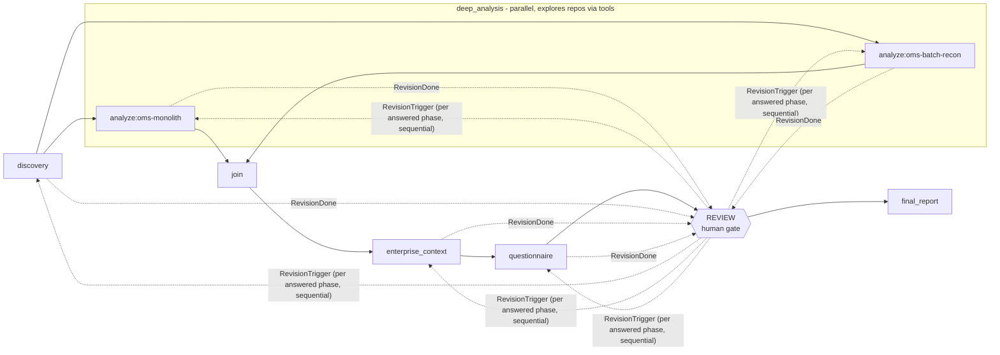
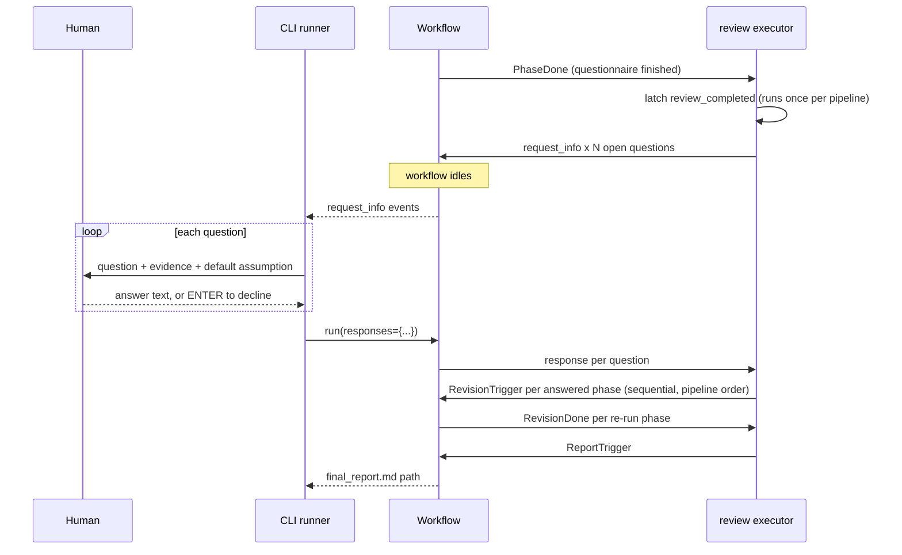
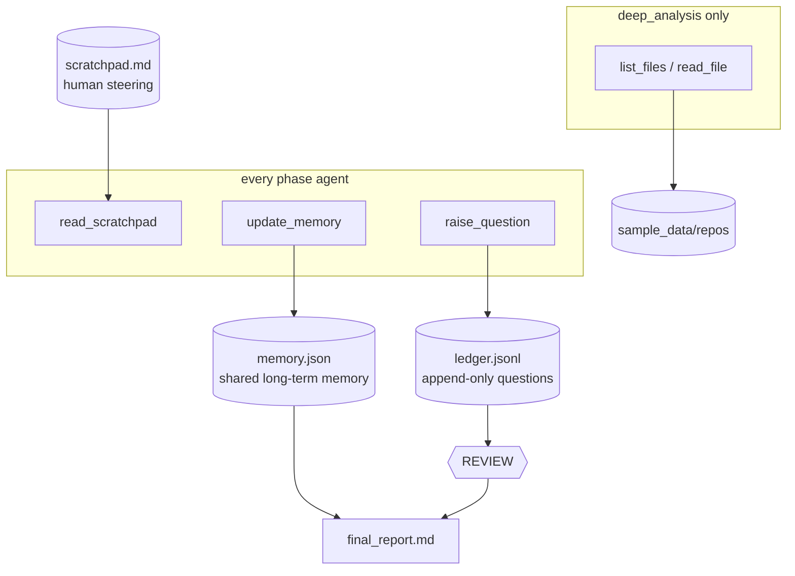

# agent-framework-hotl

Human-on-the-loop (HOTL) demo on
[Microsoft Agent Framework](https://github.com/microsoft/agent-framework):
a multi-phase agent pipeline that assesses a fictional legacy system's cloud
migration readiness, accumulates a **ledger of questions** needing human
adjudication, pauses **exactly once** at a review gate, selectively re-runs
affected phases with the human's answers, and accepts freeform steering via a
**scratchpad** file read by agents through a tool call.

Design spec: `docs/superpowers/specs/2026-07-14-hotl-pipeline-design.md`

## The pipeline



- **discovery** - what does this system REALLY do (docs vs code)?
- **deep_analysis** - one agent per repo, in parallel; explores its repo
  agentically via `list_files`/`read_file` tools; per-repo reports
- **enterprise_context** - corporate cloud strategy + security standards
  overlay
- **questionnaire** - fills the standard readiness question template
- **review** - the human gate: answer (authoritative) or decline (default
  assumption applies)
- **final_report** - readiness scorecard + recommendation + adjudication log

## How the review gate works

The pause/resume is the framework's native `request_info` mechanism - the
workflow idles while the human decides:



Declined questions cost nothing: the stated default assumption stands and is
documented. Questions raised *during* re-runs are never prompted (the gate
runs once); the final report lists them as "open - default assumption
applied".

## Artifacts and steering



Artifacts land in `output/run_<timestamp>/`: one markdown report per phase,
`memory.json`, `ledger.jsonl`, and `final_report.md` (whose adjudication log
is rendered deterministically from the ledger, never by the LLM).

## Prerequisites

- Python 3.10+ and [Poetry](https://python-poetry.org/)
- [Ollama](https://ollama.com/) running locally with the model pulled:

```bash
ollama pull gemma4:31b
```

## Run the demo

```bash
poetry install
poetry run demo    # or: poetry run demo --model <other-tools-capable-model>
```

The four phases run autonomously (the two repo analyzers in parallel), each
writing a markdown report, updating `memory.json`, and appending questions to
`ledger.jsonl`. Then the review gate presents every open question:

```text
[q-1] (discovery) Is reconciliation functionality in migration scope?
      Evidence: oms-batch-recon performs financial reconciliation; absent
      from the architecture doc.
      Default if declined: in scope.
      Your answer (ENTER to decline): _
```

Type an answer to make it authoritative (the raising phase re-runs with it),
or press ENTER to decline (the stated default stands).

## Steering via the scratchpad

`scratchpad.md` (repo root) starts empty. Write guidance into it at any
time - before a run or while one is executing:

```markdown
Focus on data-layer risks. Assume the migration window is Q3.
Be terse; bullet points only.
```

Every phase agent calls the `read_scratchpad` tool before working and follows
what it finds. This is the basic steering channel into an otherwise closed
pipeline.

## Editing the prompts

Phase prompts are not hardcoded: they live in `src/hotl_demo/prompts/` as
markdown files with YAML frontmatter (phase metadata: `name`, `order`,
`per_repo`, `report_filename`) and Jinja2 bodies (the phase instructions;
analyzers receive `{{ unit }}`). Shared wrappers `initial.md` / `revision.md`
/ `final_report.md` assemble the full prompts from `{{ sources }}`,
`{{ memory }}`, `{{ open_questions }}`, etc. Edit the markdown, rerun the
demo - no Python changes needed.

## The sample data

Everything under `sample_data/` is synthetic: three enterprise PDFs
(regenerate with `poetry run python scripts/make_pdfs.py` after editing
`docs_src/`), two fake legacy repos, and a questionnaire template. The corpus
has **planted gaps and conflicts** (Azure mandate vs `boto3` in code, missing
RTO/RPO, unspecified data-residency region, hardcoded credentials, ...) so
the agents reliably find questions worth asking a human.

## Tests and linting

```bash
poetry run pytest                              # fast, LLM-free (includes markdown lint)
OLLAMA_E2E=1 poetry run pytest -m ollama -s    # full live pipeline (slow)
poetry run pymarkdown --config .pymarkdown.json scan README.md CLAUDE.md src/hotl_demo/prompts
```
