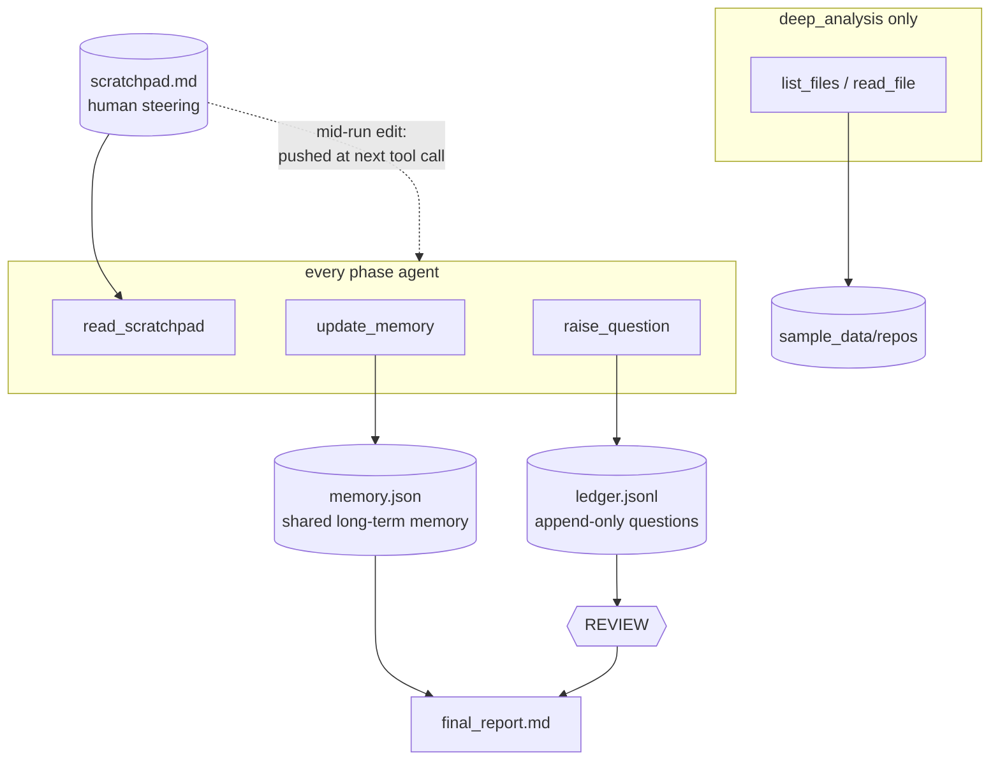

# Live Scratchpad Steering Implementation Plan

> **For agentic workers:** REQUIRED SUB-SKILL: Use superpowers:subagent-driven-development (recommended) or superpowers:executing-plans to implement this plan task-by-task. Steps use checkbox (`- [ ]`) syntax for tracking.

**Goal:** Make `scratchpad.md` a live steering channel — edits made while the pipeline is running are pushed to agents still working, which decide relevance themselves.

**Architecture:** A per-agent watermark (`ScratchpadWatch`) is polled inside **function middleware** after every tool call. On a change, the new text is enqueued to the agent's session via the framework's built-in `MessageInjectionMiddleware`, which drains it into the agent's next model call. No watcher thread, no queue, no new dependency. Requires giving `PhaseExecutor` an explicit `AgentSession` — which also repairs a latent bug (see Global Constraints).

**Tech Stack:** Python ≥3.10, Poetry, pytest (`asyncio_mode = "auto"`), Microsoft Agent Framework `agent-framework ~=1.11` (verified against 1.11.0), Ollama.

**Spec:** `docs/superpowers/specs/2026-07-15-live-scratchpad-steering-design.md` — authoritative. `docs/superpowers/specs/2026-07-14-hotl-pipeline-design.md` remains authoritative for everything else.

## Global Constraints

- **Never `str.format` model- or human-authored text.** The scratchpad is human-written and may contain literal braces. Concatenate. (Same gotcha as `_NUDGE_PREFIX` in `phases.py`.)
- **`review.py` must NOT use `from __future__ import annotations`** — not touched by this plan, but do not "helpfully" add it.
- **Never create `tests/__init__.py`.** pytest imports tests as top-level modules; `from conftest import ...` depends on this.
- **Tests are LLM-free by default** (`addopts = "-m 'not ollama'"`). No test in this plan may contact Ollama.
- **`asyncio_mode = "auto"`** is set, but every existing async test still carries an explicit `@pytest.mark.asyncio`. Match that style.
- **Tools/middleware return or log; they never raise.** Middleware must never break a tool call.
- **CLI stays stdlib** (`argparse`/`print`). Progress lines use `print`, two-space indented, matching `phases.py`.
- **Markdown lint** (`pymarkdownlnt` via `.pymarkdown.json`) covers `README.md`, `CLAUDE.md`, and `src/hotl_demo/prompts` only. Docs under `docs/` are excluded.
- **Verified framework facts** (do not re-litigate; all checked against installed 1.11.0):
  - `MiddlewareTypes` is a union spanning agent, function **and** chat middleware, in class and plain-callable form — a mixed `middleware=[...]` list is supported.
  - Function middleware signature: `async def mw(context: FunctionInvocationContext, call_next: Callable[[], Awaitable[None]]) -> None`. `call_next` takes **no arguments**.
- **`@function_middleware` is mandatory here, not decoration.** `_determine_middleware_type` classifies a plain callable via `inspect.signature(...)` and then `first_param.annotation.__name__`. Under `from __future__ import annotations` the annotation is the *string* `"FunctionInvocationContext"`, which has no `__name__` — so classification silently falls through and raises `MiddlewareException: Cannot determine middleware type`. This is the same trap CLAUDE.md documents for `review.py`'s `@response_handler`. The decorator sets a `_middleware_type` marker that is checked *first* and is immune to string annotations — verified empirically with the future import active. Keep both the decorator and the annotation: they agree, so the mismatch check passes, and `steering.py` can then use `from __future__ import annotations` like the rest of the package instead of becoming a second landmine.
  - `FunctionInvocationContext(function, arguments, session=None, metadata=None, result=None, kwargs=None, tools=None)`.
  - `MessageInjectionMiddleware()` takes no constructor args; `.enqueue_messages(session, messages)` accepts `AgentRunInputs = str | Content | Message | Sequence[...]`, so a plain `list[str]` is valid.
  - `Agent.create_session(*, session_id=None) -> AgentSession`; `Agent.run(messages, *, session: AgentSession | None = None, ...)`.
- **Behaviour change, deliberate:** `Agent.run(session=None)` is stateless per call today (`Agent` stores no session; `context_providers == []`). CLAUDE.md and the `PhaseExecutor` docstring wrongly claim otherwise, and `_REPORT_RETRY` is broken as a result. Task 3 fixes this; Task 4 corrects the docs. Do not "restore" the old stateless behaviour.

---

### Task 1: `ScratchpadWatch` — the change watermark

**Files:**
- Create: `src/hotl_demo/steering.py`
- Create: `tests/test_steering.py`

**Interfaces:**
- Consumes: nothing (pure stdlib + `pathlib`).
- Produces: `ScratchpadWatch(path: Path)` with `poll() -> str | None`. Returns the scratchpad's text when it changed since the previous call, else `None`. The **first** call always returns `None` (it baselines).

- [ ] **Step 1: Write the failing tests**

Create `tests/test_steering.py`:

```python
"""Live steering: the scratchpad watermark and the notification middleware."""
from pathlib import Path

from hotl_demo.steering import ScratchpadWatch


def _watch(tmp_path: Path, initial: str | None = None) -> tuple[ScratchpadWatch, Path]:
    pad = tmp_path / "scratchpad.md"
    if initial is not None:
        pad.write_text(initial, encoding="utf-8")
    return ScratchpadWatch(pad), pad


def test_first_poll_baselines_and_reports_nothing(tmp_path):
    # The agent's own read_scratchpad must never be echoed back at it.
    watch, _ = _watch(tmp_path, "focus on security")
    assert watch.poll() is None


def test_unchanged_content_reports_nothing(tmp_path):
    watch, _ = _watch(tmp_path, "focus on security")
    watch.poll()
    assert watch.poll() is None


def test_changed_content_is_reported_once(tmp_path):
    watch, pad = _watch(tmp_path, "focus on security")
    watch.poll()
    pad.write_text("actually, focus on cost", encoding="utf-8")
    assert watch.poll() == "actually, focus on cost"
    assert watch.poll() is None  # reported once, then quiet


def test_noop_resave_of_identical_content_is_silent(tmp_path):
    # Compared by content, not mtime: saving without editing must not notify.
    watch, pad = _watch(tmp_path, "focus on security")
    watch.poll()
    pad.write_text("focus on security", encoding="utf-8")
    assert watch.poll() is None


def test_missing_file_baselines_to_empty(tmp_path):
    watch, pad = _watch(tmp_path)  # no file at all
    assert watch.poll() is None
    pad.write_text("late guidance", encoding="utf-8")
    assert watch.poll() == "late guidance"


def test_cleared_content_returns_empty_then_new_content_reports(tmp_path):
    # Clearing yields "" (falsy - the middleware skips it) but the watermark
    # must still advance, so later content is delivered normally.
    watch, pad = _watch(tmp_path, "focus on security")
    watch.poll()
    pad.write_text("", encoding="utf-8")
    assert watch.poll() == ""
    pad.write_text("new guidance", encoding="utf-8")
    assert watch.poll() == "new guidance"
```

- [ ] **Step 2: Run the tests to verify they fail**

Run: `poetry run pytest tests/test_steering.py -v`
Expected: FAIL — `ModuleNotFoundError: No module named 'hotl_demo.steering'`

- [ ] **Step 3: Write the minimal implementation**

Create `src/hotl_demo/steering.py`:

```python
"""Live scratchpad steering: notice mid-run operator edits and push them to
the agents still working.

The steering file is normally *pulled* by the ``read_scratchpad`` tool, once,
at the start of a phase. This module adds the *push* half: a per-agent
watermark polled after every tool call, and function middleware that hands any
change to the framework's ``MessageInjectionMiddleware`` for delivery on the
agent's next model call.

Kept out of ``tools.py``, whose contract is "tools the agent calls" - this is a
delivery channel, not a tool.
"""
from __future__ import annotations

from pathlib import Path


class ScratchpadWatch:
    """Per-agent watermark over the steering file.

    Deliberately NOT shared between agents: the two deep_analysis analyzers
    run concurrently and each needs its own notion of "have I told THIS agent
    yet".

    Args:
        path: The steering file to watch. It need not exist.

    Example:
        >>> from pathlib import Path
        >>> watch = ScratchpadWatch(Path("scratchpad.md"))  # doctest: +SKIP
        >>> watch.poll()  # first call baselines  # doctest: +SKIP
    """

    def __init__(self, path: Path) -> None:
        self._path = path
        self._seen: str | None = None

    def poll(self) -> str | None:
        """Return the scratchpad text if it changed since the last poll.

        Compared by content rather than mtime, so re-saving an unedited file
        is correctly silent.

        Returns:
            The current text when it differs from the last poll; ``None`` when
            unchanged, and ``None`` on the very first call - that call only
            baselines, so an agent is never handed back the content it just
            fetched with ``read_scratchpad``.
        """
        text = self._path.read_text(encoding="utf-8") if self._path.exists() else ""
        if text == self._seen:
            return None
        # First poll establishes the baseline and reports nothing; every later
        # change reports, including a clear to "" (which the middleware skips
        # but which must still advance the watermark).
        first, self._seen = self._seen is None, text
        return None if first else text
```

- [ ] **Step 4: Run the tests to verify they pass**

Run: `poetry run pytest tests/test_steering.py -v`
Expected: PASS — 6 passed

- [ ] **Step 5: Commit**

```bash
git add src/hotl_demo/steering.py tests/test_steering.py
git commit -m "feat: ScratchpadWatch - content watermark over the steering file"
```

---

### Task 2: `make_steering_middleware` — enqueue changes to the working agent

**Files:**
- Modify: `src/hotl_demo/steering.py` (append)
- Modify: `tests/test_steering.py` (append)

**Interfaces:**
- Consumes: `ScratchpadWatch.poll()` from Task 1.
- Produces: `make_steering_middleware(watch: ScratchpadWatch, injector: MessageInjectionMiddleware, label: str)` returning an async function middleware `(context, call_next) -> None`. Task 3 passes the returned callable into `Agent(middleware=[...])`.

- [ ] **Step 1: Write the failing tests**

Append to `tests/test_steering.py` (add `import pytest` to the existing imports at the top, plus the two new `hotl_demo.steering` names):

```python
class FakeInjector:
    """Records enqueue_messages calls in place of MessageInjectionMiddleware."""

    def __init__(self):
        self.calls = []  # list[tuple[session, messages]]

    def enqueue_messages(self, session, messages):
        self.calls.append((session, messages))


class FakeFunctionContext:
    """Duck-typed FunctionInvocationContext: the middleware only reads .session."""

    def __init__(self, session="session-sentinel"):
        self.session = session


async def _call(mw, context):
    """Invoke the middleware, recording whether call_next was awaited."""
    awaited = []

    async def call_next():
        awaited.append(True)

    await mw(context, call_next)
    return awaited


@pytest.mark.asyncio
async def test_change_is_enqueued_once_with_notice_wrapping(tmp_path):
    watch, pad = _watch(tmp_path, "original")
    injector = FakeInjector()
    mw = make_steering_middleware(watch, injector, "analyze:oms-monolith")
    ctx = FakeFunctionContext()

    assert await _call(mw, ctx) == [True]  # first call baselines
    assert injector.calls == []

    pad.write_text("prioritise the Oracle licensing question", encoding="utf-8")
    await _call(mw, ctx)

    assert len(injector.calls) == 1
    session, messages = injector.calls[0]
    assert session == "session-sentinel"
    assert len(messages) == 1
    assert "prioritise the Oracle licensing question" in messages[0]
    assert "STEERING UPDATE" in messages[0]

    await _call(mw, ctx)
    assert len(injector.calls) == 1  # enqueued once, not on every later tool call


@pytest.mark.asyncio
async def test_call_next_is_always_awaited_even_with_no_change(tmp_path):
    watch, _ = _watch(tmp_path, "original")
    mw = make_steering_middleware(watch, FakeInjector(), "discovery")
    assert await _call(mw, FakeFunctionContext()) == [True]
    assert await _call(mw, FakeFunctionContext()) == [True]


@pytest.mark.asyncio
async def test_cleared_scratchpad_enqueues_nothing(tmp_path):
    # Withdrawing guidance is not new guidance to act on.
    watch, pad = _watch(tmp_path, "original")
    injector = FakeInjector()
    mw = make_steering_middleware(watch, injector, "discovery")
    await _call(mw, FakeFunctionContext())
    pad.write_text("", encoding="utf-8")
    await _call(mw, FakeFunctionContext())
    assert injector.calls == []


@pytest.mark.asyncio
async def test_missing_session_is_skipped_not_raised(tmp_path):
    watch, pad = _watch(tmp_path, "original")
    injector = FakeInjector()
    mw = make_steering_middleware(watch, injector, "discovery")
    await _call(mw, FakeFunctionContext(session=None))
    pad.write_text("new guidance", encoding="utf-8")
    await _call(mw, FakeFunctionContext(session=None))  # must not raise
    assert injector.calls == []


@pytest.mark.asyncio
async def test_notice_is_brace_safe(tmp_path):
    # The scratchpad is human-written: braces must survive verbatim.
    watch, pad = _watch(tmp_path, "original")
    injector = FakeInjector()
    mw = make_steering_middleware(watch, injector, "discovery")
    await _call(mw, FakeFunctionContext())
    pad.write_text('use {placeholder} and {"json": true}', encoding="utf-8")
    await _call(mw, FakeFunctionContext())
    assert '{placeholder}' in injector.calls[0][1][0]
    assert '{"json": true}' in injector.calls[0][1][0]
```

Update the import block at the top of `tests/test_steering.py` to:

```python
"""Live steering: the scratchpad watermark and the notification middleware."""
from pathlib import Path

import pytest

from hotl_demo.steering import ScratchpadWatch, make_steering_middleware
```

- [ ] **Step 2: Run the tests to verify they fail**

Run: `poetry run pytest tests/test_steering.py -v`
Expected: FAIL — `ImportError: cannot import name 'make_steering_middleware' from 'hotl_demo.steering'`

- [ ] **Step 3: Write the minimal implementation**

Append to `src/hotl_demo/steering.py` (and extend the import line at the top of the file):

```python
from collections.abc import Awaitable, Callable
from typing import Any

from agent_framework import FunctionInvocationContext, function_middleware
```

Then, after the `ScratchpadWatch` class:

```python
# Concatenated, NEVER str.format-ed: the scratchpad is human-written and
# routinely contains braces (code snippets, JSON). Same gotcha as the memory
# nudge in phases.py.
_NOTICE_HEAD = (
    "\n[OPERATOR STEERING UPDATE - the human edited the scratchpad while you "
    "were working. Its current contents are:]\n"
)
_NOTICE_TAIL = (
    "\n[Adapt now if this affects your current phase; otherwise ignore it and "
    "continue what you were doing.]"
)


def make_steering_middleware(
    watch: ScratchpadWatch,
    injector: Any,
    label: str,
) -> Callable[[FunctionInvocationContext, Callable[[], Awaitable[None]]], Awaitable[None]]:
    """Build function middleware that pushes scratchpad edits to a live agent.

    Detection rides on the tool calls the agent is already making: an LLM turn
    cannot be interrupted, so the next tool call is the earliest boundary at
    which anything can be delivered. This is also why no file watcher is used -
    delivery waits for that boundary regardless, so a watcher thread would buy
    nothing over polling here.

    Args:
        watch: This agent's own watermark (never share one between agents).
        injector: The ``MessageInjectionMiddleware`` instance registered on the
            same agent; its ``enqueue_messages`` drains into the next model call.
        label: Executor id, for the operator-facing progress line.

    Returns:
        An async function middleware, ready for ``Agent(middleware=[...])``.

    Example:
        >>> mw = make_steering_middleware(watch, injector, "discovery")  # doctest: +SKIP
    """
    # @function_middleware is REQUIRED, not decorative: this module uses
    # `from __future__ import annotations`, so the context annotation below is
    # the *string* "FunctionInvocationContext". The framework's callable
    # classifier reads `annotation.__name__`, which a str lacks - without the
    # decorator's marker it raises "Cannot determine middleware type". Same
    # class of trap as @response_handler in review.py.
    @function_middleware
    async def steering_middleware(
        context: FunctionInvocationContext,
        call_next: Callable[[], Awaitable[None]],
    ) -> None:
        await call_next()
        new = watch.poll()
        # Falsy covers both "no change" (None) and "cleared" (""): withdrawing
        # guidance is not new guidance to act on. Never raise - middleware must
        # not break the tool call it wraps.
        if new and context.session is not None:
            injector.enqueue_messages(
                context.session, [_NOTICE_HEAD + new + _NOTICE_TAIL]
            )
            print(f"  [steering] scratchpad update queued for {label}")

    return steering_middleware
```

- [ ] **Step 4: Run the tests to verify they pass**

Run: `poetry run pytest tests/test_steering.py -v`
Expected: PASS — 11 passed

- [ ] **Step 5: Commit**

```bash
git add src/hotl_demo/steering.py tests/test_steering.py
git commit -m "feat: function middleware enqueues scratchpad edits to the working agent"
```

---

### Task 3: Wire steering + an explicit session into `PhaseExecutor`

**Files:**
- Modify: `src/hotl_demo/phases.py` — imports; `PhaseExecutor.__init__`; `PhaseExecutor` class docstring; `_run_initial`; `on_revision`; `_invoke`
- Modify: `tests/conftest.py` — `FakeAgent`
- Modify: `tests/test_phase_executor.py` — add one test

**Interfaces:**
- Consumes: `ScratchpadWatch`, `make_steering_middleware` from Tasks 1–2.
- Produces: `PhaseExecutor` whose agent carries `[MessageInjectionMiddleware(), steering_middleware]`, and which mints one `AgentSession` per run cycle via `self._agent.create_session()`, passing it to every `run()` in that cycle. `FakeAgent` gains `create_session()` and records `sessions`.

Note: the `agent=` test seam bypasses middleware entirely (middleware lives on the real `Agent`), which is exactly why Tasks 1–2 test the middleware directly. This task's testable deliverable is the **session lifetime contract**.

- [ ] **Step 1: Update the `FakeAgent` test double**

In `tests/conftest.py`, replace the `FakeAgent` class body's `__init__` and `run` and extend the docstring:

```python
class FakeAgent:
    """Scripted stand-in for ``agent_framework.Agent``.

    Returns queued texts one per :meth:`run` call (empty string once
    exhausted) and records every prompt for assertions.

    Mirrors the real Agent's session API so executors can mint a session per
    run cycle and pass it to every ``run()`` in that cycle.

    Attributes:
        texts: Remaining scripted responses.
        prompts: Prompts received so far.
        sessions: The ``session`` passed to each :meth:`run` call, in order.
        created_sessions: Sessions handed out by :meth:`create_session`.
        side_effect: Optional callable invoked with each prompt - used to
            simulate tool side effects (e.g. writing memory) during a run.

    Example:
        >>> agent = FakeAgent(["# Report"])
        >>> import asyncio; asyncio.run(agent.run("go")).text
        '# Report'
        >>> agent.prompts
        ['go']
    """

    def __init__(self, texts, side_effect=None):
        self.texts = list(texts)
        self.prompts = []
        self.sessions = []
        self.created_sessions = []
        self.side_effect = side_effect  # optional callable(prompt) run per call

    def create_session(self, *, session_id=None):
        """Hand out an opaque session sentinel, as the real Agent does."""
        session = f"session-{len(self.created_sessions) + 1}"
        self.created_sessions.append(session)
        return session

    async def run(self, prompt, *, session=None):
        """Record prompt + session, fire the side effect, pop the next text."""
        self.prompts.append(prompt)
        self.sessions.append(session)
        if self.side_effect:
            self.side_effect(prompt)
        return FakeAgentResult(self.texts.pop(0) if self.texts else "")
```

`session` keeps a `None` default so `FinalReportExecutor` (which calls `run(prompt)` with no session and has no tools) keeps working untouched — see `tests/test_report.py`.

- [ ] **Step 2: Write the failing test**

Append to `tests/test_phase_executor.py`:

```python
@pytest.mark.asyncio
async def test_one_session_per_run_cycle_shared_by_every_turn(store, tmp_path):
    # The nudge/retry turn must see the initial turn's exploration, which only
    # works if both turns share one session. Regression guard: run(session=None)
    # is stateless per call in agent-framework, so the session must be explicit.
    spec = _spec()
    agent = FakeAgent(["# Report", "nudge reply"])  # no memory written -> nudge fires
    await _executor(store, tmp_path, spec, agent).on_start("start", FakeCtx())

    assert len(agent.sessions) == 2
    assert agent.sessions[0] is not None
    assert agent.sessions[0] == agent.sessions[1]   # same session across the cycle
    assert len(agent.created_sessions) == 1         # exactly one minted


@pytest.mark.asyncio
async def test_revision_cycle_gets_a_fresh_session(store, tmp_path):
    # Revisions are self-contained by design (the prompt carries previous_report
    # and the human answers), so they must not inherit the initial exploration.
    spec = _spec()
    store.write_report(spec.report_filename, "OLD")
    agent = FakeAgent(["# Report", "nudge reply", "NEW"])
    executor = _executor(store, tmp_path, spec, agent)
    await executor.on_start("start", FakeCtx())
    await executor.on_revision(RevisionTrigger("discovery", None, answers=[]), FakeCtx())

    assert len(agent.created_sessions) == 2
    assert agent.sessions[0] != agent.sessions[-1]  # revision ran in a new session
```

- [ ] **Step 3: Run the tests to verify they fail**

Run: `poetry run pytest tests/test_phase_executor.py -v`
Expected: FAIL — `AttributeError: 'FakeAgent' object has no attribute 'sessions'` is already fixed by Step 1, so the failure is `assert len(agent.sessions) == 2` seeing `[None, None]` (`assert None is not None`), because `PhaseExecutor` does not yet pass a session.

- [ ] **Step 4: Wire the imports in `phases.py`**

In `src/hotl_demo/phases.py`, change the `agent_framework` import line and add the steering import:

```python
from agent_framework import Agent, Executor, MessageInjectionMiddleware, WorkflowContext, handler
from agent_framework.ollama import OllamaChatClient
from jinja2 import Environment, FileSystemLoader
from pypdf import PdfReader

from .artifacts import PHASES, REPOS, ArtifactStore
from .steering import ScratchpadWatch, make_steering_middleware
from .tools import SCRATCHPAD_PATH, make_repo_tools, make_tools
```

- [ ] **Step 5: Wire the middleware and session into `PhaseExecutor.__init__`**

Replace the agent construction in `PhaseExecutor.__init__` (currently `self._agent = agent or Agent(...)`) with:

```python
        # MessageInjectionMiddleware (chat) does delivery; steering_mw (function)
        # does detection. A mixed middleware list is a supported MiddlewareTypes
        # shape, not a workaround.
        injector = MessageInjectionMiddleware()
        steering_mw = make_steering_middleware(
            ScratchpadWatch(scratchpad_path), injector, spec.executor_id
        )
        self._agent = agent or Agent(
            client=OllamaChatClient(),  # model comes from OLLAMA_MODEL env var
            name=spec.executor_id.replace(":", "_"),
            instructions="You are one phase of a multi-agent assessment pipeline.",
            tools=tools,
            middleware=[injector, steering_mw],
        )
        # Set per run cycle by _run_initial/on_revision; not shared across cycles.
        self._session = None
```

- [ ] **Step 6: Correct the `PhaseExecutor` class docstring**

Replace this paragraph in the `PhaseExecutor` docstring:

```
    The wrapped ``Agent`` keeps its session across ``run()`` calls, which is
    what makes the bounded memory nudge and report retry effective - the
    follow-up turn sees the whole earlier exploration.
```

with:

```
    Each run cycle mints ONE ``AgentSession`` shared by every turn in it, which
    is what makes the bounded memory nudge and report retry effective - the
    follow-up turn sees the whole earlier exploration. This must be explicit:
    ``Agent.run(session=None)`` is stateless per call. Revisions mint a fresh
    session, since the revision prompt is self-contained by design.

    Scratchpad edits made mid-run are pushed into the live session by the
    steering middleware (see :mod:`hotl_demo.steering`).
```

- [ ] **Step 7: Mint a session per run cycle**

In `_run_initial`, insert as the first statement of the method body (before `before = self._store.memory_key_count(...)`):

```python
        self._session = self._agent.create_session()
```

In `on_revision`, insert as the first statement of the method body (before `prompt = build_revision_prompt(...)`):

```python
        self._session = self._agent.create_session()
```

- [ ] **Step 8: Pass the session to every turn**

Replace the body of `_invoke`:

```python
    async def _invoke(self, prompt: str) -> str:
        """Run one agent turn in the current cycle's session and return its text.

        Args:
            prompt: Prompt for this turn.

        Returns:
            Final text with leaked special tokens stripped; may be empty.
        """
        result = await self._agent.run(prompt, session=self._session)
        return _clean_text(result.text)
```

- [ ] **Step 9: Run the full suite**

Run: `poetry run pytest -v`
Expected: PASS — all tests green, including the 7 pre-existing `test_phase_executor.py` tests and the 2 new ones. If `test_report.py` fails, `FakeAgent.run`'s `session` keyword lost its `None` default in Step 1.

- [ ] **Step 10: Commit**

```bash
git add src/hotl_demo/phases.py tests/conftest.py tests/test_phase_executor.py
git commit -m "feat: live scratchpad steering in PhaseExecutor; explicit per-cycle session

Agent.run(session=None) is stateless per call, so the report retry was asking
a model with no history to recall an exploration it never saw. One session per
run cycle fixes that and gives the steering middleware something to enqueue into."
```

---

### Task 4: Correct the documentation

**Files:**
- Modify: `CLAUDE.md` — Architecture and Rules/gotchas sections
- Modify: `README.md` — repo layout and the scratchpad description

**Interfaces:**
- Consumes: the finished feature from Task 3.
- Produces: docs that match the code. No code depends on this task.

Both files are in the markdown lint gate, so `tests/test_markdown_lint.py` is this task's check.

- [ ] **Step 1: Fix the false session claim in `CLAUDE.md`**

In the "Rules and gotchas" section, replace this bullet:

```markdown
- Model-output hygiene lives in `phases.py`: `_clean_text` strips leaked
  `<|...|>` template tokens; `_invoke_report` retries once on empty text
  (the agent session persists across `run()` calls, so the retry sees the
  exploration); the memory nudge is concatenated, never `str.format`-ed -
  reports contain literal braces.
```

with:

```markdown
- Model-output hygiene lives in `phases.py`: `_clean_text` strips leaked
  `<|...|>` template tokens; `_invoke_report` retries once on empty text.
  The retry only sees the earlier exploration because `_run_initial` /
  `on_revision` mint one `AgentSession` per cycle and `_invoke` passes it to
  every `run()` - `Agent.run(session=None)` is stateless per call, so this
  MUST stay explicit. The memory nudge is concatenated, never
  `str.format`-ed - reports contain literal braces.
```

- [ ] **Step 2: Document the steering module in `CLAUDE.md`**

Add this bullet to the "Architecture" section, immediately after the "Tools are the only side-effect channel" bullet:

```markdown
- **Live steering** (`steering.py`): the scratchpad is pulled once via
  `read_scratchpad`, and pushed thereafter. `ScratchpadWatch` (one per agent -
  analyzers run concurrently) is polled by function middleware after every
  tool call; a change is handed to the framework's
  `MessageInjectionMiddleware`, which drains it into the agent's next model
  call. An LLM turn cannot be interrupted, so a tool call is the earliest
  possible delivery point - which is why there is no file watcher. A cleared
  scratchpad advances the watermark but notifies nobody.
```

Note: `README.md` has **no repo-layout tree** — do not go looking for one. It uses ASCII hyphens (` - `) rather than em-dashes throughout; match that.

- [ ] **Step 3: Update the README intro and spec links**

In `README.md`, replace the trailing clause of the opening paragraph:

```markdown
affected phases with the human's answers, and accepts freeform steering via a
**scratchpad** file read by agents through a tool call.

Design spec: `docs/superpowers/specs/2026-07-14-hotl-pipeline-design.md`
```

with:

```markdown
affected phases with the human's answers, and accepts freeform steering via a
**scratchpad** file - read at phase start, and pushed to agents mid-run when
the human edits it while the pipeline is working.

Design specs:
`docs/superpowers/specs/2026-07-14-hotl-pipeline-design.md` (pipeline) and
`docs/superpowers/specs/2026-07-15-live-scratchpad-steering-design.md`
(live steering)
```

- [ ] **Step 4: Show the push channel in the "Artifacts and steering" diagram**

In `README.md`, in the `## Artifacts and steering` mermaid block, add one dotted edge immediately after the existing `SP[(scratchpad.md<br>human steering)] --> T1` line:

```
    SP -. "mid-run edit:<br>pushed at next tool call" .-> AGENT
```

The resulting diagram (validated as a mermaid flowchart) is:



- [ ] **Step 5: Document the live behaviour in the scratchpad section**

In `README.md`, under `## Steering via the scratchpad`, replace the closing paragraph:

```markdown
Every phase agent calls the `read_scratchpad` tool before working and follows
what it finds. This is the basic steering channel into an otherwise closed
pipeline.
```

with:

```markdown
Every phase agent calls the `read_scratchpad` tool before working and follows
what it finds. Edits made *while* the pipeline runs are not missed either:
they are pushed to whichever agents are still working, arriving at that
agent's next tool call, and each agent decides whether the guidance is
relevant to its phase. Watch for:

```text
  [steering] scratchpad update queued for analyze:oms-monolith
```

An LLM turn cannot be interrupted, so a tool call is the earliest possible
delivery point - which is why there is no file watcher. Phases that already
finished are not re-run; that is the review gate's job.
```

- [ ] **Step 6: Run the lint gate and the full suite**

Run: `poetry run pytest tests/test_markdown_lint.py -v && poetry run pytest`
Expected: PASS — lint clean, all tests green.

If lint fails, run this for the specific rule numbers and fix them:

```bash
poetry run pymarkdown --config .pymarkdown.json scan README.md CLAUDE.md
```

- [ ] **Step 7: Commit**

```bash
git add CLAUDE.md README.md
git commit -m "docs: live scratchpad steering; correct the session-persistence claim"
```

---

## Verification

After Task 4, confirm the whole feature end to end:

- [ ] `poetry run pytest` — full suite green (LLM-free).
- [ ] Manual live check (needs Ollama + the model): start `poetry run demo`, and while `deep_analysis` is running, append a line to `scratchpad.md` such as `Ignore Oracle licensing; the CTO has already settled it.` and save. Expect a `  [steering] scratchpad update queued for analyze:<repo>` line in the output, and expect the affected analyzer's report to acknowledge or visibly ignore the instruction. This is the only way to exercise the real middleware — `FakeAgent` bypasses it.
- [ ] `OLLAMA_E2E=1 poetry run pytest -m ollama -s` still passes (~10 min).
