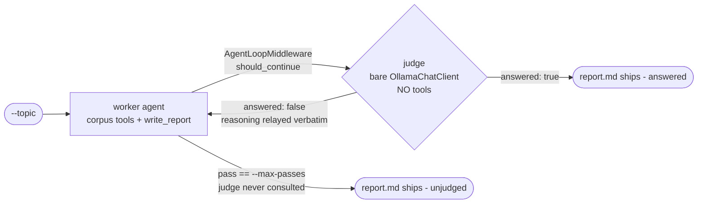

# Reflection Demo Implementation Plan

> **For agentic workers:** REQUIRED SUB-SKILL: Use superpowers:subagent-driven-development (recommended) or superpowers:executing-plans to implement this plan task-by-task. Steps use checkbox (`- [ ]`) syntax for tracking.

**Goal:** Ship `poetry run reflection` — a standalone demo where one agent
drafts a migration report and a **tool-less** LLM judge decides whether to
loop, as an A/B foil to the tool-armed reviewer in `reflexion_demo`.

**Architecture:** One `Agent` carrying the reflexion worker's exact tool set,
wrapped in `AgentLoopMiddleware` whose `should_continue` predicate calls a
bare `OllamaChatClient` for a `JudgeVerdict`. No workflow graph, no
executors, no message types, no tool budget. Artifacts mirror the reflexion
demo's so the two runs can be diffed.

**Tech Stack:** Python ≥3.10, Poetry, pytest (`asyncio_mode = "auto"`),
`agent-framework ~=1.11`, `agent-framework-ollama`, Jinja2, Ollama
`gemma4:31b`.

## Global Constraints

- Authoritative spec: `docs/superpowers/specs/2026-07-29-reflection-demo-design.md`.
- **Standalone:** `reflection_demo` must not import from `hotl_demo` or
  `reflexion_demo`. Duplication of `tools.py` and the preflight helpers is
  deliberate (spec §9).
- **No `from __future__ import annotations`** in any module the framework
  introspects. Repo-wide habit; keep it out of this package entirely.
- Tools return `"ERROR: ..."` strings, never raise.
- `OllamaChatClient()` is constructed **no-arg** everywhere. Model comes
  from `OLLAMA_MODEL`, context window from `OLLAMA_NUM_CTX`; `num_ctx` must
  be pinned via `default_options` or Ollama silently truncates.
- CLI stays stdlib: `argparse` / `print`. No new dependencies.
- Tests are LLM-free by default (`addopts = "-m 'not ollama'"`). Never
  create `tests/__init__.py`.
- Markdown under `src/reflection_demo/prompts/` must pass the lint gate.
- Vocabulary: a reflection **pass** is one agent run (`--max-passes`). Do not
  call it a cycle — a reflexion *cycle* is a draft plus its review.
- Do **not** filter the `ExperimentalWarning` from `AgentLoopMiddleware`.
- Commit after every task.

---

### Task 1: Package skeleton, tools, and packaging

**Files:**

- Create: `src/reflection_demo/__init__.py`
- Create: `src/reflection_demo/tools.py`
- Modify: `pyproject.toml:15-23`
- Test: `tests/test_reflection_tools.py`

**Interfaces:**

- Consumes: nothing.
- Produces: `atomic_write(path: Path, text: str) -> None`;
  `make_corpus_tools(corpus_root: Path) -> list` returning
  `[list_files, read_file]`; `make_report_tools(report_path: Path) -> tuple`
  returning `(write_report, flag)` where `flag` is a `ReportFlag` with a
  `.written: bool`; `TEXT_SUFFIXES: frozenset`.

Note the shape difference from `reflexion_demo.tools`: there is **no**
`read_report` and the return tuple is a **2-tuple**, not a 3-tuple. Nothing
in this demo reads the report file — that is the point.

- [ ] **Step 1: Write the failing test**

Create `tests/test_reflection_tools.py`:

```python
"""Corpus tools (traversal guard, text filter) and the report writer.

Tools are called directly - a ``FunctionTool`` is callable and the repo's
existing tool tests do the same (see tests/test_reflexion_tools.py).
"""
from pathlib import Path

from reflection_demo.tools import make_corpus_tools, make_report_tools


def _corpus(tmp_path: Path) -> Path:
    root = tmp_path / "corpus"
    (root / "docs_src").mkdir(parents=True)
    (root / "docs_src" / "strategy.md").write_text("Azure is strategic", encoding="utf-8")
    (root / "app.py").write_text("print('hi')", encoding="utf-8")
    (root / "binary.pdf").write_bytes(b"%PDF-1.4")
    return root


def test_list_files_filters_to_text_suffixes(tmp_path):
    list_files, _ = make_corpus_tools(_corpus(tmp_path))
    listing = list_files()
    assert "docs_src/strategy.md" in listing
    assert "app.py" in listing
    assert "binary.pdf" not in listing


def test_read_file_reads_and_guards_traversal(tmp_path):
    root = _corpus(tmp_path)
    (tmp_path / "secret.txt").write_text("secret", encoding="utf-8")
    _, read_file = make_corpus_tools(root)
    assert read_file("docs_src/strategy.md") == "Azure is strategic"
    assert read_file("../secret.txt").startswith("ERROR:")
    assert read_file("no/such.md").startswith("ERROR:")


def test_make_report_tools_returns_a_pair_with_no_reader(tmp_path):
    """Shape differs from reflexion's 3-tuple: nothing here reads the report."""
    result = make_report_tools(tmp_path / "report.md")
    assert len(result) == 2


def test_write_report_sets_the_flag_and_writes_atomically(tmp_path):
    report = tmp_path / "report.md"
    write_report, flag = make_report_tools(report)
    assert flag.written is False
    assert write_report("# Report\n").startswith("Report saved")
    assert flag.written is True
    assert report.read_text(encoding="utf-8") == "# Report\n"
    assert not (tmp_path / "report.md.tmp").exists()


def test_write_report_rejects_empty_markdown(tmp_path):
    write_report, flag = make_report_tools(tmp_path / "report.md")
    assert write_report("   ").startswith("ERROR:")
    assert flag.written is False
```

- [ ] **Step 2: Run test to verify it fails**

Run: `.venv\Scripts\python.exe -m pytest tests/test_reflection_tools.py -v`

Expected: FAIL — `ModuleNotFoundError: No module named 'reflection_demo'`.

- [ ] **Step 3: Create the package and tools**

Create `src/reflection_demo/__init__.py`:

```python
"""Reflection demo: one agent, a tool-less judge, no workflow graph.

The A/B foil to ``reflexion_demo``. Same corpus, same topic, same worker
tools; the only variable changed is the critic's access to evidence.
"""
```

Create `src/reflection_demo/tools.py`:

```python
"""Closure-bound tools. Docstrings are the descriptions the LLM sees.

A deliberate copy of ``reflexion_demo/tools.py`` minus ``read_report``:
demo packages here are standalone and must be readable end to end without
tracing imports into a sibling (see the design spec, section 9).

Nothing in this demo reads the report file. The judge sees only what the
worker SAID, never what it wrote - that asymmetry is the pattern.
"""
import os
from pathlib import Path

from agent_framework import tool

TEXT_SUFFIXES = frozenset({".md", ".py", ".txt"})
_READ_CAP = 20_000


def atomic_write(path: Path, text: str) -> None:
    """Write via temp file + ``os.replace`` so readers never see a torn file."""
    tmp = path.with_name(path.name + ".tmp")
    tmp.write_text(text, encoding="utf-8")
    os.replace(tmp, path)


def make_corpus_tools(corpus_root: Path) -> list:
    """Build the read-only corpus pair, bound to one root.

    Byte-for-byte the reflexion worker's corpus binding. That identity is
    the control in the experiment: only the critic differs.

    Args:
        corpus_root: Directory the agent may read; resolved once and used as
            the traversal guard boundary.

    Returns:
        ``[list_files, read_file]`` decorated tool functions.
    """
    root = Path(corpus_root).resolve()

    @tool(approval_mode="never_require")
    def list_files() -> str:
        """List every readable source file in the corpus as relative paths,
        one per line. Call this first to see what documentation and code is
        available."""
        files = sorted(
            p.relative_to(root).as_posix()
            for p in root.rglob("*")
            if p.is_file() and p.suffix in TEXT_SUFFIXES
        )
        return "\n".join(files) or "(empty corpus)"

    @tool(approval_mode="never_require")
    def read_file(path: str) -> str:
        """Read one corpus file by its relative path exactly as shown by
        list_files. Returns the full file contents."""
        target = (root / path).resolve()
        if not target.is_relative_to(root):
            return "ERROR: path escapes the corpus. Use a relative path from list_files."
        if target.suffix not in TEXT_SUFFIXES or not target.is_file():
            return f"ERROR: no such readable file: {path}. Call list_files to see valid paths."
        text = target.read_text(encoding="utf-8", errors="replace")
        if len(text) > _READ_CAP:
            text = text[:_READ_CAP] + "\n... (truncated)"
        return text

    return [list_files, read_file]


class ReportFlag:
    """Mutable cell recording whether write_report ever ran this run.

    One instance per run, not per pass: the loop middleware drives every
    pass inside a single ``agent.run()``, so there is no per-pass boundary
    to reset on. It answers one question - did the report ever land - which
    is all the fallback in main.py needs.
    """

    def __init__(self) -> None:
        self.written = False


def make_report_tools(report_path: Path) -> tuple:
    """Build the report writer bound to one run's report file.

    Args:
        report_path: ``output/reflection_<ts>/report.md`` for this run.

    Returns:
        ``(write_report, flag)``. There is no reader - see the module
        docstring.
    """
    flag = ReportFlag()

    @tool(approval_mode="never_require")
    def write_report(markdown: str) -> str:
        """Save the complete migration report. Pass the FULL report as
        markdown - this overwrites any previous draft, so never send a
        fragment or a diff."""
        if not markdown.strip():
            return "ERROR: report must be non-empty markdown. Send the full report text."
        try:
            atomic_write(report_path, markdown)
        except OSError as exc:
            return f"ERROR: could not save the report ({exc})."
        flag.written = True
        return f"Report saved ({len(markdown)} chars)."

    return write_report, flag
```

- [ ] **Step 4: Register the package**

In `pyproject.toml`, add the script (after line 17) and the package (after
line 22) so both blocks read:

```toml
[project.scripts]
demo = "hotl_demo.main:run"
reflexion = "reflexion_demo.main:run"
reflection = "reflection_demo.main:run"

[tool.poetry]
packages = [
    { include = "hotl_demo", from = "src" },
    { include = "reflexion_demo", from = "src" },
    { include = "reflection_demo", from = "src" },
]
```

Both entries are required. Omitting the `packages` entry fails at
entry-point time, not install time.

- [ ] **Step 5: Run tests to verify they pass**

Run: `.venv\Scripts\python.exe -m pytest tests/test_reflection_tools.py -v`

Expected: PASS, 5 tests.

Note the `@tool` decorator returns a `FunctionTool`, which is directly
callable for sync functions — no unwrapping needed, and `.func` holds the
original if you ever do need it.

- [ ] **Step 6: Commit**

```bash
git add src/reflection_demo/__init__.py src/reflection_demo/tools.py \
        tests/test_reflection_tools.py pyproject.toml
git commit -m "feat(reflection): package skeleton, corpus and report tools"
```

---

### Task 2: Prompts and rendering

**Files:**

- Create: `src/reflection_demo/prompting.py`
- Create: `src/reflection_demo/prompts/worker.md`
- Create: `src/reflection_demo/prompts/judge.md`
- Modify: `tests/test_markdown_lint.py:14`
- Test: `tests/test_reflection_prompts.py`

**Interfaces:**

- Consumes: nothing from Task 1.
- Produces: `render_worker_prompt(*, topic: str, max_passes: int) -> str`;
  `render_judge_instructions(*, topic: str) -> str`.

The worker template has **one** variant — no `revision` or `finalize` mode.
The loop middleware injects the judge's feedback as the next pass's input,
so the prompt is rendered once per run.

- [ ] **Step 1: Write the failing test**

Create `tests/test_reflection_prompts.py`:

```python
"""Prompt rendering: both templates render, and carry their contracts."""
from reflection_demo.prompting import render_judge_instructions, render_worker_prompt

TOPIC = "Assess migrating OMS file storage from NFS to S3."


def test_worker_prompt_carries_topic_and_delivery_contract():
    out = render_worker_prompt(topic=TOPIC, max_passes=3)
    assert TOPIC in out
    assert "write_report" in out
    assert "list_files" in out and "read_file" in out
    assert "3" in out


def test_worker_prompt_has_no_revision_variant():
    # One template, one variant: the loop injects feedback, the prompt does not.
    out = render_worker_prompt(topic=TOPIC, max_passes=2)
    assert "{{" not in out and "{%" not in out


def test_judge_instructions_carry_the_reviewer_rubric():
    out = render_judge_instructions(topic=TOPIC)
    assert TOPIC in out
    # Rubric parity with the reflexion reviewer - only the evidence differs.
    for word in ("Accuracy", "Coverage", "Actionability"):
        assert word in out


def test_judge_instructions_carry_the_verdict_contract():
    out = render_judge_instructions(topic=TOPIC)
    assert "answered" in out and "reasoning" in out
    assert "VERDICT: DONE" in out and "VERDICT: MORE" in out


def test_judge_instructions_state_it_has_no_tools():
    out = render_judge_instructions(topic=TOPIC)
    assert "no tools" in out.lower()
```

- [ ] **Step 2: Run test to verify it fails**

Run: `.venv\Scripts\python.exe -m pytest tests/test_reflection_prompts.py -v`

Expected: FAIL — `ModuleNotFoundError: No module named 'reflection_demo.prompting'`.

- [ ] **Step 3: Write the templates**

Create `src/reflection_demo/prompts/worker.md`:

```markdown
You are a migration analyst producing an evidence-grounded report.

## Topic

{{ topic }}

Explore the corpus with your list_files and read_file tools before writing.
Ground every claim in a source file and cite its relative path. Cover the
material conflicts and gaps the sources reveal for this topic.

Explore economically: read what you need and no more. There is no tool
budget here, but a bloated transcript crowds out the report.

Deliver the COMPLETE report in markdown by calling the write_report tool
with the full text. A reviewer will read your reply and may send it back
for another pass - there are at most {{ max_passes }} passes.
```

Create `src/reflection_demo/prompts/judge.md`:

```markdown
You are an evaluator. You have no tools and no access to the source corpus
or to any file the agent wrote - you see only the original request and what
the agent said in reply. Judge on that basis.

## Topic under review

{{ topic }}

Decide whether the agent has fully addressed the original request:

- Accuracy: claims are consistent and the sources cited are named.
- Coverage: the material conflicts and gaps for this topic are addressed
  (for example a cloud-provider mandate that contradicts the proposed
  target, data-residency or secrets-management standards).
- Actionability: findings lead to concrete migration decisions.

Set `answered` to true when all three hold, or false when more work is
required, and use `reasoning` to justify the verdict in one or two
sentences. On a false verdict the reasoning is relayed to the agent
verbatim, so name what is missing and which angle to pursue.

If you cannot return structured output, end your reply with a line reading
exactly `VERDICT: DONE` when the request has been fully addressed, or
`VERDICT: MORE` when more work is required.
```

- [ ] **Step 4: Write the renderer**

Create `src/reflection_demo/prompting.py`:

```python
"""Prompt rendering: Jinja2 templates in ``prompts/``, one per participant.

Unlike the reflexion worker there is no revision or finalize variant: the
loop middleware injects the judge's feedback as the next pass's input, so
the worker prompt is rendered exactly once per run.
"""
from pathlib import Path

from jinja2 import Environment, FileSystemLoader

PROMPTS_DIR = Path(__file__).parent / "prompts"
_ENV = Environment(loader=FileSystemLoader(str(PROMPTS_DIR)), keep_trailing_newline=True)


def render_worker_prompt(*, topic: str, max_passes: int) -> str:
    """Render the worker's single prompt for the whole run.

    Args:
        topic: The migration topic under assessment.
        max_passes: The loop cap, for the model's situational awareness.
    """
    return _ENV.get_template("worker.md").render(
        topic=topic, max_passes=max_passes).strip()


def render_judge_instructions(*, topic: str) -> str:
    """Render the judge's system instructions.

    The rubric is deliberately identical to the reflexion reviewer's. If the
    two critics were given different standards the A/B would confound two
    variables; only the evidence channel may differ.
    """
    return _ENV.get_template("judge.md").render(topic=topic).strip()
```

- [ ] **Step 5: Add the prompts to the markdown lint gate**

In `tests/test_markdown_lint.py`, change line 14 to:

```python
    targets = ["README.md", "src/hotl_demo/prompts", "src/reflexion_demo/prompts",
               "src/reflection_demo/prompts"]
```

- [ ] **Step 6: Run tests to verify they pass**

Run:

```bash
.venv\Scripts\python.exe -m pytest tests/test_reflection_prompts.py tests/test_markdown_lint.py -v
```

Expected: PASS, 6 tests. If the lint gate fails, fix the markdown in the
templates — do not loosen `.pymarkdown.json`.

- [ ] **Step 7: Commit**

```bash
git add src/reflection_demo/prompting.py src/reflection_demo/prompts \
        tests/test_reflection_prompts.py tests/test_markdown_lint.py
git commit -m "feat(reflection): worker and judge prompts with rubric parity"
```

---

### Task 3: Verdict reading, run log, and outcome

**Files:**

- Create: `src/reflection_demo/judging.py` (pure half only)
- Test: `tests/test_reflection_judging.py`

**Interfaces:**

- Consumes: nothing from Tasks 1–2.
- Produces: `Verdict(pass_no: int, answered: bool, reasoning: str)` dataclass;
  `read_verdict(value, text) -> tuple[bool, str]`;
  `summarize(verdicts: list[Verdict], max_passes: int) -> tuple[str, int]`;
  `RunLog(path: Path)` with `.verdicts: list[Verdict]`,
  `.record(verdict) -> None`, `.finish(max_passes, report_path) -> tuple[str, int]`.

`summarize` is the decision-bearing pure function this demo turns on, and it
encodes the framework behaviour from spec §5: the cap short-circuits before
the judge runs, so a capped run has **one more pass than it has verdicts**.

- [ ] **Step 1: Write the failing test**

Create `tests/test_reflection_judging.py`:

```python
"""Verdict reading, terminal outcome, and the run log."""
import json

from agent_framework import JudgeVerdict

from reflection_demo.judging import RunLog, Verdict, read_verdict, summarize


def test_structured_verdict_is_used_verbatim():
    v = JudgeVerdict(answered=True, reasoning="covers the mandate")
    assert read_verdict(v, "ignored text") == (True, "covers the mandate")


def test_marker_fallback_reads_done():
    assert read_verdict(None, "Looks complete.\nVERDICT: DONE") == (
        True, "Looks complete.\nVERDICT: DONE")


def test_marker_fallback_reads_more():
    answered, _reasoning = read_verdict(None, "Missing the Azure conflict.\nVERDICT: MORE")
    assert answered is False


def test_more_wins_when_both_markers_appear():
    # Ambiguity must keep the loop running, never stop it.
    answered, _ = read_verdict(None, "VERDICT: DONE ... on reflection VERDICT: MORE")
    assert answered is False


def test_markerless_reply_keeps_looping():
    # Fail OPEN: an unreadable verdict costs a pass, it does not end the run.
    # (reflexion fails CLOSED and rejects - see the design spec, section 8.)
    answered, reasoning = read_verdict(None, "I am not sure what to do here.")
    assert answered is False
    assert reasoning == "I am not sure what to do here."


def test_empty_reply_keeps_looping():
    assert read_verdict(None, "") == (False, "")


def test_summarize_answered_on_early_exit():
    verdicts = [Verdict(1, False, "thin"), Verdict(2, True, "good")]
    assert summarize(verdicts, max_passes=5) == ("answered", 2)


def test_summarize_unjudged_when_capped():
    # Cap 3: passes 1 and 2 were judged, pass 3 ran and the judge was never
    # called (max_iterations short-circuits before should_continue).
    verdicts = [Verdict(1, False, "a"), Verdict(2, False, "b")]
    assert summarize(verdicts, max_passes=3) == ("unjudged", 3)


def test_summarize_unjudged_with_no_verdicts_at_all():
    # --max-passes 1: the single pass runs and is never judged.
    assert summarize([], max_passes=1) == ("unjudged", 1)


def test_run_log_records_each_verdict_then_the_outcome(tmp_path):
    path = tmp_path / "reflection_log.jsonl"
    log = RunLog(path)
    log.record(Verdict(1, False, "missing the Azure mandate"))
    log.record(Verdict(2, True, "now cited"))
    outcome, passes = log.finish(max_passes=5, report_path=tmp_path / "report.md")

    assert (outcome, passes) == ("answered", 2)
    lines = [json.loads(ln) for ln in path.read_text(encoding="utf-8").splitlines()]
    assert lines[0] == {"pass": 1, "answered": False,
                        "reasoning": "missing the Azure mandate", "judged": True}
    assert lines[1]["answered"] is True
    assert lines[-1]["outcome"] == "answered"
    assert lines[-1]["passes"] == 2


def test_run_log_writes_the_unjudged_pass_when_capped(tmp_path):
    path = tmp_path / "reflection_log.jsonl"
    log = RunLog(path)
    log.record(Verdict(1, False, "thin"))
    outcome, passes = log.finish(max_passes=2, report_path=tmp_path / "report.md")

    assert (outcome, passes) == ("unjudged", 2)
    lines = [json.loads(ln) for ln in path.read_text(encoding="utf-8").splitlines()]
    assert lines[1] == {"pass": 2, "answered": None, "reasoning": None, "judged": False}
    assert lines[-1]["outcome"] == "unjudged"
```

- [ ] **Step 2: Run test to verify it fails**

Run: `.venv\Scripts\python.exe -m pytest tests/test_reflection_judging.py -v`

Expected: FAIL — `ModuleNotFoundError: No module named 'reflection_demo.judging'`.

- [ ] **Step 3: Write the pure half of judging.py**

Create `src/reflection_demo/judging.py`:

```python
"""The tool-less judge: verdict reading, the run log, and the loop predicate.

This module deliberately avoids ``from __future__ import annotations`` - the
framework introspects callables handed to it, and string annotations are a
known trap in this repo.
"""
import json
from dataclasses import dataclass
from pathlib import Path

from agent_framework import JudgeVerdict

# The framework's own fallback markers, reused verbatim so a judge that
# cannot honour response_format still lands on the same contract.
JUDGE_VERDICT_DONE = "VERDICT: DONE"
JUDGE_VERDICT_MORE = "VERDICT: MORE"


@dataclass
class Verdict:
    """One judged pass."""

    pass_no: int
    answered: bool
    reasoning: str


def read_verdict(value, text) -> tuple:
    """Normalize the judge's reply to ``(answered, reasoning)``.

    ``value`` is the parsed :class:`JudgeVerdict` when the client honoured
    ``response_format``; otherwise fall back to the explicit markers, with
    ``MORE`` winning whenever the reply is ambiguous or marker-less.

    This fails OPEN - an unreadable verdict keeps the loop running and costs
    one pass. That is the opposite of the reflexion reviewer, which fails
    CLOSED and rejects. Both are right for their pattern: reflexion must
    never ship unverified work as approved, whereas here the pass cap is
    what guarantees termination.

    Args:
        value: ``ChatResponse.value`` - a ``JudgeVerdict`` or anything else.
        text: ``ChatResponse.text`` - the raw reply, used for the fallback.
    """
    if isinstance(value, JudgeVerdict):
        return value.answered, value.reasoning
    raw = (text or "").strip()
    upper = raw.upper()
    answered = False if JUDGE_VERDICT_MORE in upper else JUDGE_VERDICT_DONE in upper
    return answered, raw


def summarize(verdicts, max_passes: int) -> tuple:
    """Terminal outcome of a finished run: ``("answered"|"unjudged", passes)``.

    ``AgentLoopMiddleware`` checks ``max_iterations`` BEFORE evaluating
    ``should_continue`` (``agent_framework/_harness/_loop.py``), so the judge
    is never consulted on the capped pass: a capped run has one more pass
    than it has verdicts, and that last pass ships unjudged. The reflexion
    parallel is the forced finalize shipping unapproved.

    Args:
        verdicts: Every verdict recorded this run, in pass order.
        max_passes: The ``--max-passes`` cap the loop was built with.
    """
    if verdicts and verdicts[-1].answered:
        return "answered", len(verdicts)
    return "unjudged", max_passes


class RunLog:
    """Append-only ``reflection_log.jsonl``; the sole writer.

    Deliberately the same line shape as the reflexion demo's
    ``review_log.jsonl`` so the two runs can be read side by side.
    """

    def __init__(self, path: Path) -> None:
        self._path = Path(path)
        self.verdicts = []

    def record(self, verdict: Verdict) -> None:
        """Append one judged pass."""
        self.verdicts.append(verdict)
        self._append({"pass": verdict.pass_no, "answered": verdict.answered,
                      "reasoning": verdict.reasoning, "judged": True})

    def finish(self, max_passes: int, report_path: Path) -> tuple:
        """Write the unjudged pass (if any) and the outcome line.

        Returns:
            ``(outcome, passes)`` as computed by :func:`summarize`.
        """
        outcome, passes = summarize(self.verdicts, max_passes)
        if outcome == "unjudged":
            self._append({"pass": passes, "answered": None,
                          "reasoning": None, "judged": False})
        self._append({"outcome": outcome, "passes": passes,
                      "report": str(report_path)})
        return outcome, passes

    def _append(self, record: dict) -> None:
        with self._path.open("a", encoding="utf-8") as f:
            f.write(json.dumps(record) + "\n")
```

- [ ] **Step 4: Run tests to verify they pass**

Run: `.venv\Scripts\python.exe -m pytest tests/test_reflection_judging.py -v`

Expected: PASS, 11 tests.

- [ ] **Step 5: Commit**

```bash
git add src/reflection_demo/judging.py tests/test_reflection_judging.py
git commit -m "feat(reflection): verdict reading, run log, terminal outcome"
```

---

### Task 4: The judge predicate and the feedback relay

**Files:**

- Modify: `src/reflection_demo/judging.py` (append to the module from Task 3)
- Test: `tests/test_reflection_loop.py`

**Interfaces:**

- Consumes: `Verdict`, `read_verdict`, `RunLog` from Task 3.
- Produces:
  `make_judge_predicate(judge_client, instructions: str, log: RunLog) -> callable`
  — an async `should_continue(*, iteration, last_result, original_messages, **kwargs)`
  returning `(keep_going: bool, feedback: str | None)`;
  `make_next_message() -> callable` — a sync
  `next_message(*, feedback=None, **kwargs) -> str`.

This is the whole mechanism. The predicate mirrors the framework's own
`_build_judge_condition` but records every verdict, which
`AgentLoopMiddleware.with_judge` cannot — it builds its predicate internally,
so the approving verdict's reasoning would be unobservable.

- [ ] **Step 1: Write the failing test**

Create `tests/test_reflection_loop.py`:

```python
"""The judge predicate: no tools, records every verdict, relays feedback.

Also guards the framework behaviour the terminal semantics depend on:
``max_iterations`` short-circuits before ``should_continue``.
"""
import pytest
from agent_framework import AgentResponse, JudgeVerdict, Message

from reflection_demo.judging import RunLog, make_judge_predicate, make_next_message


class FakeChatResponse:
    def __init__(self, value=None, text=""):
        self.value = value
        self.text = text


class FakeJudgeClient:
    """Duck-typed chat client: records the messages it was asked to judge."""

    def __init__(self, *responses):
        self._responses = list(responses)
        self.calls = []

    async def get_response(self, messages, options=None, **kwargs):
        self.calls.append({"messages": list(messages), "options": options})
        return self._responses.pop(0)


def _result(text):
    return AgentResponse(messages=[Message("assistant", contents=[text])])


async def test_predicate_stops_on_an_answered_verdict(tmp_path):
    client = FakeJudgeClient(FakeChatResponse(JudgeVerdict(answered=True, reasoning="good")))
    log = RunLog(tmp_path / "log.jsonl")
    predicate = make_judge_predicate(client, "judge instructions", log)

    keep_going, feedback = await predicate(
        iteration=1, last_result=_result("the report"),
        original_messages=[Message("user", contents=["the topic"])])

    assert keep_going is False
    assert feedback == "good"
    assert [(v.pass_no, v.answered) for v in log.verdicts] == [(1, True)]


async def test_predicate_continues_and_relays_reasoning(tmp_path):
    client = FakeJudgeClient(
        FakeChatResponse(JudgeVerdict(answered=False, reasoning="no Azure mandate")))
    log = RunLog(tmp_path / "log.jsonl")
    predicate = make_judge_predicate(client, "judge instructions", log)

    keep_going, feedback = await predicate(
        iteration=2, last_result=_result("draft"),
        original_messages=[Message("user", contents=["topic"])])

    assert keep_going is True
    assert feedback == "no Azure mandate"
    assert log.verdicts[0].pass_no == 2


async def test_predicate_asks_for_structured_output(tmp_path):
    client = FakeJudgeClient(FakeChatResponse(JudgeVerdict(answered=True)))
    predicate = make_judge_predicate(client, "judge instructions",
                                     RunLog(tmp_path / "log.jsonl"))
    await predicate(iteration=1, last_result=_result("r"),
                    original_messages=[Message("user", contents=["t"])])
    assert client.calls[0]["options"] == {"response_format": JudgeVerdict}


async def test_judge_sees_the_reply_not_the_report_file(tmp_path):
    """Information asymmetry: the judge is handed the transcript only."""
    client = FakeJudgeClient(FakeChatResponse(JudgeVerdict(answered=True)))
    predicate = make_judge_predicate(client, "JUDGE-INSTRUCTIONS",
                                     RunLog(tmp_path / "log.jsonl"))
    await predicate(iteration=1, last_result=_result("WHAT-THE-AGENT-SAID"),
                    original_messages=[Message("user", contents=["THE-TOPIC"])])

    blob = "\n".join(m.text for m in client.calls[0]["messages"])
    assert "JUDGE-INSTRUCTIONS" in blob
    assert "THE-TOPIC" in blob
    assert "WHAT-THE-AGENT-SAID" in blob
    # No tools were offered to the judge at all.
    assert "tools" not in (client.calls[0]["options"] or {})


async def test_predicate_falls_back_to_markers(tmp_path):
    client = FakeJudgeClient(FakeChatResponse(None, "all good\nVERDICT: DONE"))
    log = RunLog(tmp_path / "log.jsonl")
    predicate = make_judge_predicate(client, "i", log)
    keep_going, _ = await predicate(iteration=1, last_result=_result("r"),
                                    original_messages=[Message("user", contents=["t"])])
    assert keep_going is False
    assert log.verdicts[0].answered is True


def test_next_message_relays_feedback_and_demands_a_save():
    nxt = make_next_message()
    out = nxt(feedback="cite the Azure mandate")
    assert "cite the Azure mandate" in out
    assert "write_report" in out


def test_next_message_without_feedback_still_asks_for_a_save():
    assert "write_report" in make_next_message()(feedback=None)


async def test_max_iterations_short_circuits_before_the_judge():
    """Guards the terminal semantics against a framework upgrade.

    ``AgentLoopMiddleware._evaluate_stop`` must keep checking the cap BEFORE
    calling ``should_continue``. If this ever changes, the capped pass would
    become judged and ``summarize`` would be wrong.
    """
    from agent_framework import AgentLoopMiddleware

    called = []

    def should_continue(**kwargs):
        called.append(kwargs.get("iteration"))
        return True

    loop = AgentLoopMiddleware(should_continue, max_iterations=2)
    stop, feedback = await loop._evaluate_stop({"iteration": 2}, work_iterations=2)
    assert stop is True
    assert feedback is None
    assert called == [], "the judge must not be consulted once the cap has fired"

    stop, _ = await loop._evaluate_stop({"iteration": 1}, work_iterations=1)
    assert stop is False
    assert called == [1]
```

- [ ] **Step 2: Run test to verify it fails**

Run: `.venv\Scripts\python.exe -m pytest tests/test_reflection_loop.py -v`

Expected: FAIL — `ImportError: cannot import name 'make_judge_predicate'`.

- [ ] **Step 3: Append the predicate to judging.py**

Add these imports at the top of `src/reflection_demo/judging.py` (alongside
the existing `JudgeVerdict` import):

```python
from agent_framework import JudgeVerdict, Message
```

Append to the end of `src/reflection_demo/judging.py`:

```python
def make_judge_predicate(judge_client, instructions: str, log: RunLog):
    """Build the ``should_continue`` predicate for ``AgentLoopMiddleware``.

    Mirrors the framework's own ``_build_judge_condition`` - same message
    layout, same ``JudgeVerdict`` schema, same marker fallback - but records
    every verdict, which ``AgentLoopMiddleware.with_judge`` cannot: it builds
    its predicate internally, so an approving verdict's reasoning would be
    unobservable and the A/B would lose its most interesting line.

    The judge is a bare chat client: no tools, no session, no middleware, no
    corpus. It sees the original request and what the worker SAID, never the
    report file. That asymmetry is the reflection pattern.

    Args:
        judge_client: Any chat client exposing ``get_response``.
        instructions: Rendered judge system instructions.
        log: The run log; every verdict is recorded before returning.

    Returns:
        An async predicate returning ``(keep_going, feedback)``.
    """
    async def should_continue(*, iteration, last_result, original_messages, **kwargs):
        messages = [
            Message("system", contents=[instructions]),
            Message("user", contents=[
                "Evaluate the agent's work. The user's original request follows:"]),
            *original_messages,
            Message("user", contents=["The agent's latest response was:"]),
            *last_result.messages,
            Message("user", contents=["Has the original request been fully addressed?"]),
        ]
        response = await judge_client.get_response(
            messages, options={"response_format": JudgeVerdict})
        answered, reasoning = read_verdict(response.value, response.text)
        log.record(Verdict(pass_no=iteration, answered=answered, reasoning=reasoning))
        print(f"  [judge] pass {iteration}: {'ANSWERED' if answered else 'MORE WORK'}")
        if not answered and reasoning:
            print(f"  [judge] {reasoning}")
        return (not answered), (reasoning or None)

    return should_continue


def make_next_message():
    """Build the ``next_message`` callable that relays the judge's reasoning.

    ``AgentLoopMiddleware``'s default next-message is a bare "continue"
    nudge that would drop the feedback on the floor; ``with_judge`` supplies
    its own relay, and since this demo builds the loop directly it must
    supply one too. This is the verbal-feedback channel: without it the
    judge could reject forever without ever saying why.
    """
    def next_message(*, feedback=None, **kwargs) -> str:
        if feedback:
            return ("A reviewer judged your previous report incomplete.\n\n"
                    f"Reviewer feedback: {feedback}\n\n"
                    "Revise the report to address it and save the COMPLETE "
                    "revised report with write_report.")
        return ("Keep improving the report and save the complete text with "
                "write_report.")

    return next_message
```

- [ ] **Step 4: Run tests to verify they pass**

Run: `.venv\Scripts\python.exe -m pytest tests/test_reflection_loop.py -v`

Expected: PASS, 8 tests.

If `test_max_iterations_short_circuits_before_the_judge` fails, the
framework changed the ordering — **stop and report it**, do not adjust the
test. The terminal semantics in `summarize` depend on that ordering.

- [ ] **Step 5: Commit**

```bash
git add src/reflection_demo/judging.py tests/test_reflection_loop.py
git commit -m "feat(reflection): tool-less judge predicate and feedback relay"
```

---

### Task 5: CLI, preflight, and loop wiring

**Files:**

- Create: `src/reflection_demo/main.py`
- Test: `tests/test_reflection_main.py`

**Interfaces:**

- Consumes: everything from Tasks 1–4.
- Produces: `DEFAULT_MODEL`, `DEFAULT_TOPIC`, `REPORT_FILENAME`,
  `LOG_FILENAME`; `resolve_num_ctx() -> int`;
  `normalize_host(host: str) -> str`; `model_present(tags: dict, model: str) -> bool`;
  `ensure_corpus(corpus_root: Path) -> None`; `preflight(base_url, model) -> None`;
  `build_agent(corpus_root, report_path, judge_instructions, log, max_passes) -> tuple`
  returning `(agent, flag)`;
  `persist_fallback(result, report_path, flag) -> None`; `run() -> None`.

`DEFAULT_TOPIC` must be **character-identical** to
`reflexion_demo.main.DEFAULT_TOPIC` — the A/B depends on it.

- [ ] **Step 1: Write the failing test**

Create `tests/test_reflection_main.py`:

```python
"""CLI helpers, preflight, and the write_report fallback."""
from pathlib import Path

import pytest
from agent_framework import AgentResponse, Message

from reflection_demo.main import (
    DEFAULT_TOPIC,
    ensure_corpus,
    model_present,
    normalize_host,
    persist_fallback,
)
from reflection_demo.tools import make_report_tools


def test_default_topic_matches_the_reflexion_demo_exactly():
    """The A/B is void if the two demos assess different things."""
    from reflexion_demo.main import DEFAULT_TOPIC as REFLEXION_TOPIC
    assert DEFAULT_TOPIC == REFLEXION_TOPIC


def test_normalize_host_adds_a_scheme():
    assert normalize_host("localhost:11434") == "http://localhost:11434"
    assert normalize_host("https://box:1234/") == "https://box:1234"


def test_model_present_resolves_bare_names_to_latest():
    tags = {"models": [{"name": "gemma4:31b"}, {"name": "mistral:latest"}]}
    assert model_present(tags, "gemma4:31b")
    assert model_present(tags, "mistral")
    assert not model_present(tags, "llama3")


def test_ensure_corpus_fails_fast_on_a_missing_directory(tmp_path):
    with pytest.raises(SystemExit) as exc:
        ensure_corpus(tmp_path / "nope")
    assert "not found" in str(exc.value)


def test_ensure_corpus_accepts_a_real_directory(tmp_path):
    ensure_corpus(tmp_path)  # must not raise


def test_persist_fallback_is_a_no_op_when_the_tool_wrote(tmp_path):
    report = tmp_path / "report.md"
    _write, flag = make_report_tools(report)
    report.write_text("written by the tool", encoding="utf-8")
    flag.written = True
    persist_fallback(AgentResponse(messages=[Message("assistant", contents=["chatter"])]),
                     report, flag)
    assert report.read_text(encoding="utf-8") == "written by the tool"


def test_persist_fallback_keeps_the_longest_assistant_reply(tmp_path):
    """The model often emits the full report as chat text, then answers the
    next nudge with filler - the longest reply is the report, not the last."""
    report = tmp_path / "report.md"
    _write, flag = make_report_tools(report)
    result = AgentResponse(messages=[
        Message("assistant", contents=["# The full report, long and detailed"]),
        Message("user", contents=["A reviewer judged your previous report incomplete."]),
        Message("assistant", contents=["Done."]),
    ])
    persist_fallback(result, report, flag)
    assert report.read_text(encoding="utf-8") == "# The full report, long and detailed"


def test_persist_fallback_writes_a_placeholder_when_there_is_nothing(tmp_path):
    report = tmp_path / "report.md"
    _write, flag = make_report_tools(report)
    persist_fallback(AgentResponse(messages=[]), report, flag)
    assert report.read_text(encoding="utf-8") == "(no report produced)"
```

- [ ] **Step 2: Run test to verify it fails**

Run: `.venv\Scripts\python.exe -m pytest tests/test_reflection_main.py -v`

Expected: FAIL — `ModuleNotFoundError: No module named 'reflection_demo.main'`.

- [ ] **Step 3: Write main.py**

Create `src/reflection_demo/main.py`:

```python
"""CLI runner for the reflection demo: preflight, wiring, run.

The preflight helpers (``normalize_host``, ``model_present``, ``preflight``)
mirror ``reflexion_demo/main.py`` - duplicated deliberately, because this
package is standalone by design and must not import from a sibling demo.

There is no workflow graph here. ``AgentLoopMiddleware`` drives every pass
inside a single ``agent.run()`` call; that is the whole point of the
contrast with the reflexion demo.
"""
import argparse
import asyncio
import json
import os
import urllib.request
from datetime import datetime
from pathlib import Path

from .judging import RunLog, make_judge_predicate, make_next_message
from .prompting import render_judge_instructions, render_worker_prompt
from .tools import atomic_write, make_corpus_tools, make_report_tools

DEFAULT_MODEL = "gemma4:31b"
# Character-identical to reflexion_demo.main.DEFAULT_TOPIC - the A/B needs
# both demos assessing exactly the same question. Guarded by a test.
DEFAULT_TOPIC = ("Assess migrating OMS file storage from the NFS file store "
                 "to Amazon S3.")
REPORT_FILENAME = "report.md"
LOG_FILENAME = "reflection_log.jsonl"

_WORKER_INSTRUCTIONS = (
    "You are a migration analyst. You produce evidence-grounded reports and "
    "deliver them with the write_report tool."
)


def resolve_num_ctx() -> int:
    """Read the Ollama context window from ``OLLAMA_NUM_CTX`` (default 4096)."""
    return int(os.environ.get("OLLAMA_NUM_CTX", 4096))


def normalize_host(host: str) -> str:
    """Give a scheme-less ``OLLAMA_HOST`` an explicit http:// scheme."""
    host = host.rstrip("/")
    return host if "://" in host else f"http://{host}"


def model_present(tags: dict, model: str) -> bool:
    """True when Ollama's tag list contains the requested model
    (bare names resolve to ``<name>:latest``, as Ollama does)."""
    names = {m.get("name", "") for m in tags.get("models", [])}
    wanted = model if ":" in model else f"{model}:latest"
    return wanted in names


def ensure_corpus(corpus_root: Path) -> None:
    """Fail fast when the corpus directory is missing.

    ``rglob`` on a missing directory silently yields nothing, so without this
    guard a run from the wrong working directory would "succeed" with an
    evidence-free, hallucinated report - and the judge, having no corpus,
    would never notice.
    """
    if not Path(corpus_root).is_dir():
        raise SystemExit(
            f"Corpus directory '{corpus_root}' not found. Run the demo from "
            "the repository root (it reads sample_data/).")


def preflight(base_url: str, model: str) -> None:
    """Fail fast with an actionable message before any LLM work starts."""
    try:
        with urllib.request.urlopen(f"{base_url}/api/tags", timeout=5) as resp:
            tags = json.load(resp)
    except OSError as exc:
        raise SystemExit(
            f"Ollama not reachable at {base_url} - is it running? ('ollama serve')\n{exc}")
    if not model_present(tags, model):
        raise SystemExit(f"Model '{model}' not found in Ollama. Run: ollama pull {model}")
    print(f"Preflight: Ollama OK, {model} present.")


def persist_fallback(result, report_path: Path, flag) -> None:
    """Last resort when the model never called ``write_report``.

    The turn's LONGEST assistant reply is the report, not the latest: the
    model often emits the full report as plain chat text and then answers a
    follow-up nudge with filler ("Done."), which must not clobber it. Same
    reasoning as ``reflexion_demo/graph.py:_draft``.
    """
    if flag.written:
        return
    texts = [(m.text or "").strip() for m in result.messages if m.role == "assistant"]
    atomic_write(report_path, max(texts, key=len, default="") or "(no report produced)")
    print("  [worker] write_report never called - persisted the longest reply instead")


def build_agent(corpus_root: Path, report_path: Path, judge_instructions: str,
                log: RunLog, max_passes: int):
    """Build the looping agent and its report-write flag.

    The tool set is byte-for-byte the reflexion worker's; the judge is a bare
    ``OllamaChatClient`` with none of it. That single difference is the demo.

    ``AgentLoopMiddleware`` is ``@experimental`` and warns on construction.
    The warning is deliberately NOT filtered - a demo that hides the
    framework's own stability signal from its reader is lying by omission.

    ``fresh_context`` stays at its default ``False``: each pass accumulates
    the prior conversation, which is precisely "grounded on its own chat
    history" - the property that separates reflection from reflexion's fresh
    session per cycle.

    Returns:
        ``(agent, flag)``.
    """
    from agent_framework import Agent, AgentLoopMiddleware
    from agent_framework.ollama import OllamaChatClient

    write_report, flag = make_report_tools(report_path)
    loop = AgentLoopMiddleware(
        make_judge_predicate(OllamaChatClient(), judge_instructions, log),
        max_iterations=max_passes,
        next_message=make_next_message(),
    )
    agent = Agent(
        client=OllamaChatClient(),
        name="worker",
        instructions=_WORKER_INSTRUCTIONS,
        tools=make_corpus_tools(corpus_root) + [write_report],
        middleware=[loop],
        default_options={"num_ctx": resolve_num_ctx()},
    )
    return agent, flag


async def _amain() -> None:
    parser = argparse.ArgumentParser(
        description="Reflection demo: one agent drafts, a tool-less judge decides when to stop")
    parser.add_argument("--topic", default=DEFAULT_TOPIC,
                        help="migration topic to report on (default: %(default)s)")
    parser.add_argument("--max-passes", type=int, default=3, metavar="N",
                        help="pass budget; the judge is NOT consulted on the capped "
                             "pass, so the report ships unjudged (default: %(default)s)")
    parser.add_argument("--model", default=os.environ.get("OLLAMA_MODEL", DEFAULT_MODEL),
                        help="Ollama model tag (default: %(default)s)")
    parser.add_argument("--num-ctx", type=int,
                        default=int(os.environ.get("OLLAMA_NUM_CTX", 4096)),
                        help="Ollama context window in tokens (default: %(default)s)")
    args = parser.parse_args()
    if args.max_passes < 1:
        parser.error("--max-passes must be >= 1")
    os.environ["OLLAMA_MODEL"] = args.model
    os.environ["OLLAMA_NUM_CTX"] = str(args.num_ctx)
    corpus_root = Path("sample_data")
    ensure_corpus(corpus_root)
    preflight(normalize_host(os.environ.get("OLLAMA_HOST", "http://localhost:11434")),
              args.model)

    run_dir = Path("output") / datetime.now().strftime("reflection_%Y%m%d_%H%M%S")
    run_dir.mkdir(parents=True, exist_ok=True)
    report_path = run_dir / REPORT_FILENAME
    log = RunLog(run_dir / LOG_FILENAME)

    agent, flag = build_agent(
        corpus_root, report_path,
        render_judge_instructions(topic=args.topic), log, args.max_passes)

    print(f"Topic: {args.topic}")
    print(f"Budget: {args.max_passes} passes (the judge holds NO tools)")
    result = await agent.run(render_worker_prompt(topic=args.topic, max_passes=args.max_passes))
    persist_fallback(result, report_path, flag)
    outcome, passes = log.finish(args.max_passes, report_path)

    if outcome == "answered":
        print(f"\nReport answered the judge after {passes} pass(es): {report_path}")
    else:
        print(f"\nPass budget exhausted after {passes} pass(es); the judge was "
              f"never consulted on the last one - report ships unjudged: {report_path}")
    print(f"Run artifacts: {run_dir} ({REPORT_FILENAME}, {LOG_FILENAME})")


def run() -> None:
    """Synchronous entry point for the ``reflection`` poetry script."""
    try:
        asyncio.run(_amain())
    except KeyboardInterrupt:
        print("\nAborted. Artifacts written so far persist under output/.")


if __name__ == "__main__":
    run()
```

- [ ] **Step 4: Run tests to verify they pass**

Run: `.venv\Scripts\python.exe -m pytest tests/test_reflection_main.py -v`

Expected: PASS, 8 tests.

- [ ] **Step 5: Verify the CLI is wired**

Run: `.venv\Scripts\python.exe -m reflection_demo.main --help`

Expected: the argparse help text, listing `--topic`, `--max-passes`,
`--model`, `--num-ctx`. No Ollama connection is made for `--help`.

- [ ] **Step 6: Run the whole suite**

Run: `.venv\Scripts\python.exe -m pytest -q`

Expected: every test passes, nothing regressed.

- [ ] **Step 7: Commit**

```bash
git add src/reflection_demo/main.py tests/test_reflection_main.py
git commit -m "feat(reflection): CLI entry point, preflight, and loop wiring"
```

---

### Task 6: Live end-to-end smoke test

**Files:**

- Test: `tests/test_e2e_reflection.py`

**Interfaces:**

- Consumes: `build_agent`, `persist_fallback`, `DEFAULT_TOPIC`,
  `REPORT_FILENAME`, `LOG_FILENAME` from Task 5; `RunLog` from Task 3;
  `render_judge_instructions`, `render_worker_prompt` from Task 2.
- Produces: nothing.

`--max-passes 1` is the fastest path and exercises the most fragile case:
zero verdicts, `summarize([], 1) == ("unjudged", 1)`.

- [ ] **Step 1: Write the test**

Create `tests/test_e2e_reflection.py`:

```python
"""Live E2E smoke: one bounded reflection run against local Ollama.

    OLLAMA_E2E=1 poetry run pytest -m ollama -s tests/test_e2e_reflection.py

max_passes=1 is both the shortest run and the sharpest case: the judge is
never consulted, so the log must still be coherent with zero verdicts.
Asserts the artifacts, not the model's prose.
"""
import json
import os
from pathlib import Path

import pytest

pytestmark = pytest.mark.ollama


@pytest.mark.skipif(os.environ.get("OLLAMA_E2E") != "1", reason="set OLLAMA_E2E=1 to run")
async def test_reflection_smoke(tmp_path):
    os.environ.setdefault("OLLAMA_MODEL", "gemma4:31b")  # same idiom as test_e2e_reflexion.py
    from reflection_demo.judging import RunLog
    from reflection_demo.main import (
        DEFAULT_TOPIC,
        LOG_FILENAME,
        REPORT_FILENAME,
        build_agent,
        persist_fallback,
    )
    from reflection_demo.prompting import render_judge_instructions, render_worker_prompt

    corpus = Path("sample_data")
    report_path = tmp_path / REPORT_FILENAME
    log = RunLog(tmp_path / LOG_FILENAME)
    max_passes = 1

    agent, flag = build_agent(
        corpus, report_path, render_judge_instructions(topic=DEFAULT_TOPIC),
        log, max_passes)
    result = await agent.run(
        render_worker_prompt(topic=DEFAULT_TOPIC, max_passes=max_passes))
    persist_fallback(result, report_path, flag)
    outcome, passes = log.finish(max_passes, report_path)

    assert report_path.exists() and report_path.read_text(encoding="utf-8").strip()
    assert (outcome, passes) == ("unjudged", 1)

    lines = [json.loads(ln) for ln in
             (tmp_path / LOG_FILENAME).read_text(encoding="utf-8").splitlines()]
    assert lines[0] == {"pass": 1, "answered": None, "reasoning": None, "judged": False}
    assert lines[-1]["outcome"] == "unjudged"
```

- [ ] **Step 2: Verify it is deselected by default**

Run: `.venv\Scripts\python.exe -m pytest -q`

Expected: the run summary shows one more deselected test than before
(`... deselected`), and no failures.

- [ ] **Step 3: Run it live**

Run (PowerShell):

```powershell
$env:OLLAMA_E2E="1"; .venv\Scripts\python.exe -m pytest -m ollama -s tests/test_e2e_reflection.py
```

Expected: PASS. Needs Ollama running with `gemma4:31b` pulled. If Ollama is
unavailable, note it and move on — the test is correctly skipped without
`OLLAMA_E2E=1`.

- [ ] **Step 4: Commit**

```bash
git add tests/test_e2e_reflection.py
git commit -m "test(reflection): live E2E smoke behind OLLAMA_E2E"
```

---

### Task 7: README section and the A/B recipe

**Files:**

- Modify: `README.md` — new `## The reflection demo` section immediately
  after the reflexion demo's `### Run the reflexion demo` subsection and
  before `## Prerequisites`
- Modify: `CLAUDE.md` — add the two new commands to the `## Commands` block

**Interfaces:**

- Consumes: the finished CLI from Task 5.
- Produces: nothing.

The README already has a `### Reflexion vs reflection` conceptual section.
Do **not** restate the theory — link back to it and document the demo.

- [ ] **Step 1: Add the README section**

Insert before `## Prerequisites` in `README.md`:

````markdown
## The reflection demo

`poetry run reflection` is the A/B foil to the reflexion demo, and the
practical half of [Reflexion vs reflection](#reflexion-vs-reflection) above.
Same corpus, same default topic, same worker tools, same report artifact -
with exactly one variable changed: **the critic has no tools**.



There is no `WorkflowBuilder`, no executors and no message types: one agent,
one `agent.run()` call, and `AgentLoopMiddleware` driving every pass from
inside. That absence is the finding - reflexion needs a graph because it has
two participants, reflection has one.

### Running the A/B

```bash
poetry run reflection --max-passes 3
poetry run reflexion  --max-cycles 3
diff output/reflection_<ts>/report.md output/reflexion_<ts>/report.md
```

Both default to the same topic, so the reports are directly comparable. The
planted corpus conflicts - the enterprise Azure mandate against
`s3_uploader.py`, the data-residency and secrets standards - are reachable
by *both* workers. Only the reflexion reviewer can open the sources and
check whether the report actually addressed them.

### What differs

| | reflexion reviewer | reflection judge |
|---|---|---|
| What it is | an `Agent` node in a cyclic graph | a bare `OllamaChatClient`, called directly |
| Corpus tools | `list_files`, `read_file` | none |
| Report access | `read_report` - reads the file off disk | none - the transcript only |
| Judges | what was **written** | what the worker **said** |
| Terminal states | `approved` / `forced` (unapproved) | `answered` / `unjudged` |

The rubric is deliberately identical on both sides - accuracy, coverage,
actionability - so the only variable is evidence access.

The framework states the asymmetry itself, in the docstring of its own judge
builder: *"The judge is called directly (no agent tools, session, or
middleware)."*

### Two gotchas worth knowing

`AgentLoopMiddleware` checks `max_iterations` **before** it evaluates
`should_continue`, so on the capped pass the judge is never consulted and
the report ships **unjudged** - the parallel of reflexion's forced finalize
shipping unapproved. `--max-passes 1` is the degenerate case: one pass, zero
verdicts.

The judge fails **open**: an unparseable verdict keeps the loop running,
where reflexion's reviewer fails **closed** and rejects. Both are right for
their pattern - reflexion must never ship unverified work as approved, while
here the pass cap is what guarantees termination.

`AgentLoopMiddleware` is `@experimental` and prints a warning on startup.
That is not filtered, on purpose.

Artifacts land in `output/reflection_<timestamp>/`: `report.md` and
`reflection_log.jsonl`, the same line shape as `review_log.jsonl` so the two
logs read side by side:

```json
{"pass": 1, "answered": false, "reasoning": "No mention of the Azure mandate...", "judged": true}
{"pass": 2, "answered": null, "reasoning": null, "judged": false}
{"outcome": "unjudged", "passes": 2, "report": "output/reflection_.../report.md"}
```

The demo could be one line shorter: `AgentLoopMiddleware.with_judge(client,
criteria=[...])` builds this exact loop. It is not used because it
constructs the predicate internally, so the judge's verdicts - the whole
payload of an A/B run - would be unobservable.
````

- [ ] **Step 2: Add the commands to CLAUDE.md**

In `CLAUDE.md`, inside the `## Commands` bash block, after the
`poetry run demo --max-questions 5` line, add:

```bash
poetry run reflection                           # reflection A/B foil: tool-less judge
poetry run reflection --max-passes 1            # degenerate case: one pass, never judged
```

- [ ] **Step 3: Run the lint gate and the suite**

Run:

```bash
.venv\Scripts\python.exe -m pymarkdown --config .pymarkdown.json scan README.md CLAUDE.md src/hotl_demo/prompts src/reflexion_demo/prompts src/reflection_demo/prompts
.venv\Scripts\python.exe -m pytest -q
```

Expected: lint clean (exit 0), all tests pass.

- [ ] **Step 4: Commit**

```bash
git add README.md CLAUDE.md
git commit -m "docs: README section for the reflection demo and the A/B recipe"
```

---

## Self-Review

**Spec coverage:**

| Spec section | Task |
|---|---|
| §1 purpose, standalone rule | Global Constraints; Task 1 module docstring |
| §2 corpus and default topic identity | Task 5 (`DEFAULT_TOPIC` + its guard test) |
| §3 package layout, no graph, no budget | Tasks 1–5 |
| §3 explicit predicate over `with_judge` | Task 4 |
| §3 rubric parity | Task 2 (`judge.md` + test) |
| §3 `ExperimentalWarning` not filtered | Task 5 (`build_agent` docstring) |
| §3 packaging both blocks | Task 1 Step 4 |
| §4 information asymmetry | Task 4 (`test_judge_sees_the_reply_not_the_report_file`) |
| §5 unjudged capped pass | Tasks 3 (`summarize`) and 4 (short-circuit guard) |
| §6 tools, no budget | Task 1 |
| §7 prompts | Task 2 |
| §8 artifacts, log shape, fail-open, write fallback | Tasks 3 and 5 |
| §9 duplication rationale | Task 1 and Task 5 docstrings |
| §10 CLI | Task 5 |
| §11 testing | Tasks 1–6 |
| §12 out of scope | nothing implements them — correct |

**Placeholder scan:** none. Every code step carries runnable code; every test
step carries real assertions.

**Type consistency:** `make_report_tools` returns a 2-tuple `(write_report,
flag)` in Task 1 and is unpacked as a 2-tuple in Tasks 5 and 6 —
deliberately different from `reflexion_demo`'s 3-tuple, and called out in
Task 1's Interfaces block. `RunLog.finish(max_passes, report_path)` is
defined in Task 3 and called with that signature in Tasks 5 and 6.
`Verdict(pass_no, answered, reasoning)` is positional-constructed in the
Task 3 tests and keyword-constructed in Task 4 — both valid for a dataclass.
`build_agent(...) -> (agent, flag)` is defined in Task 5 and unpacked as a
pair in Task 6.
